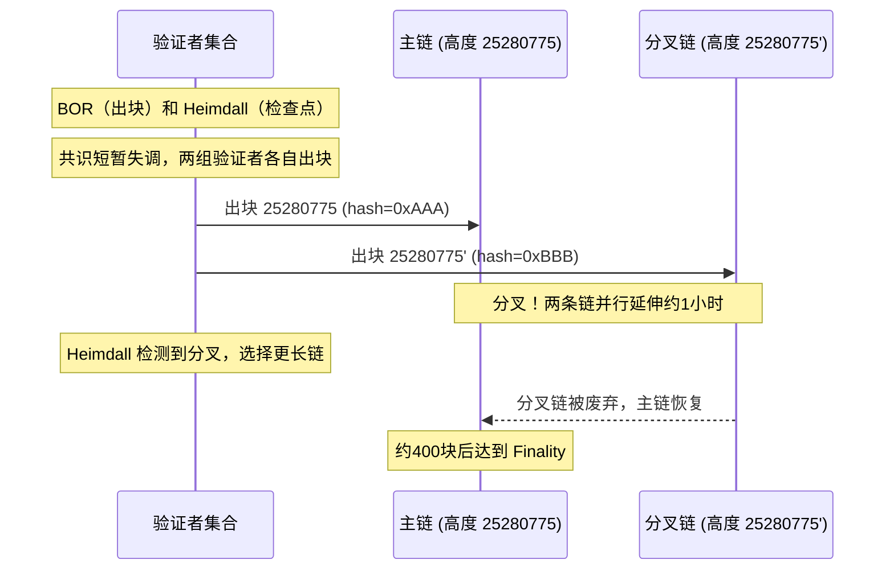

# 00 - 架构深度技术笔记

## 为什么密钥层和钱包层要分离

### 最小权限原则
钱包服务需要的不是"主种子"，而是"当前使用的那个地址的私钥"。
通过分层架构：
- walletmanager 持有主种子，按需派生子密钥
- 钱包服务只拿到当前使用的子私钥，内存中最多存在几十个地址的私钥
- 即使钱包服务被攻破，攻击者也无法生成任意地址的私钥

### 稳定性隔离
密钥服务的网络策略极严格（通常只允许来自特定钱包服务 IP 的请求），
如果密钥服务和钱包业务在同一进程，一个 bug 导致重启就会重新拉取所有私钥，
增加私钥在内存中的暴露时间。

### 审计面
独立进程 = 独立日志 = 精确审计每次私钥分发。
混在一起时，私钥访问日志会淹没在大量业务日志中。

---

## 三种链类型的核心差异

### Account 型（ETH/BSC）
- 地址在所有交易中复用（充值地址固定）
- 余额是账户状态（一个 mapping: address → balance），不是 UTXO 集
- **Nonce** 防重放：每笔交易的 Nonce 必须严格递增，跳号会导致后续交易全部堵塞
- 重组回滚：只需回滚余额变更记录，不需要恢复 UTXO 集

### UTXO 型（BTC/LTC）
- 每笔交易消耗若干 UTXO，产生新的 UTXO
- 无 Nonce 概念，交易之间没有显式的顺序依赖
- **重组回滚的额外步骤**：被该块"花费"的 UTXO，需要从 Spent 状态恢复为 Available
  - 如果漏做这步，那些 UTXO 会永久"消失"，用户余额凭空减少
- 归集时需要 UTXO 选择算法（最优找零）

### Tag 型（XRP/XLM）
- 交易所只有一个地址，通过 Memo/Tag 区分不同用户
- **Memo 丢失是最常见的用户投诉**：用户忘记填 Memo，资金到账但系统无法归属
- 充值处理：必须校验 Memo 是否在已分配列表中，忽略无 Memo 或无效 Memo 的充值
- 归集：不需要，因为资金已经在交易所的地址上

---

## SafeHeight 详解

```
当前最高块：1000
确认数配置：12（ETH）

SafeHeight = 1000 - 12 = 988

含义：
- 高度 ≤ 988 的充值：已获得足够确认，可以归集和上账
- 高度 > 988 的充值：还在确认中，禁止归集（重组后会被撤销）

Front = SafeHeight = 988
Back  = 当前最高块 = 1000
```

滑动窗口：随着新块的产生，Front 和 Back 同步向前推进，窗口内保存 12 个区块头用于重组检测。

---

## 各链确认数为什么差异这么大

| 链 | 确认数 | 原因 |
|----|--------|------|
| ETH | 12 | PoS 后，Finality Checkpoint 机制，12 块后极难逆转 |
| BSC | 20 | 3秒出块，21个验证者，20块约1分钟，历史上无深度重组 |
| Polygon | 400 | 2023年高度25280775发生深度分叉，持续约1小时，影响约3亿美元TVL |
| ETC | 500 | PoW + 算力低，历史上多次51%攻击（2020年三次，最深3693块）|
| Metis（L2）| 1 | Sequencer 提交到 L1 后基本不回滚，强最终性 |
| zkSync（L2）| 5000 | ZK Proof 提交到 L1 有延迟，证明上链前状态不算最终 |

### 为什么 L2 链确认数差异这么大

虽然 L2 理论上依赖 L1 最终性，但实际生产中要看：
1. **Sequencer 的去中心化程度**：中心化 Sequencer 的 finality 比去中心化更快（更可预测）
2. **数据提交频率**：Optimistic Rollup 每小时提交一次，vs ZK Rollup 每几分钟一次
3. **Fraud Proof / ZK Proof 的挑战期**：Optimistic 有7天挑战期，ZK Proof 上链后即最终
4. **历史稳定性**：新上线的链保守配置，运行稳定后可以降低

### Polygon 为什么需要 400 确认（Mermaid 图）



结论：Polygon 的 BOR + Heimdall 双层共识在出块层（BOR）和检查点层（Heimdall）之间存在
延迟窗口，历史上这个窗口期曾导致深度分叉。400 确认 ≈ 覆盖了这个历史最大分叉深度的安全边际。
