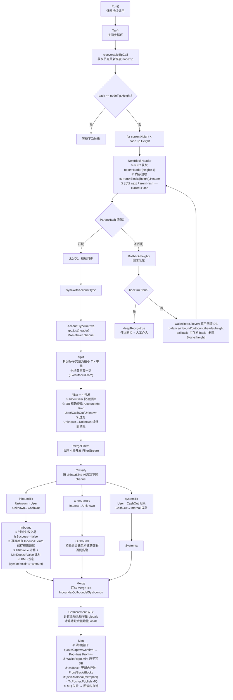

# 03 - 充值防护深度技术笔记

## 7层防护的设计哲学

**纵深防御（Defense in Depth）**：每层独立，任何一层失效不会导致系统被攻破。
攻击者必须同时绕过全部7层，成本极高。

---

## 第1层：Receipt.Status 校验

```go
if receipt.Status != 1 {
    return false, nil  // 过滤掉失败交易
}
```

- `status == 1`：交易执行成功
- `status == 0`：交易执行失败（合约 revert），但仍消耗 Gas
- **防御**：攻击者发送一个会 revert 的交易，如果不校验 status，可能把失败交易当充值

---

## 第2层：Transfer 事件日志校验

```go
const transferEventSig = "0xddf252ad1be2c89b69c2b068fc378daa952ba7f163c4a11628f55a4df523b3ef"

for _, log := range receipt.Logs {
    // 必须检查 Removed（重组期间被撤销的日志）
    if log.Removed {
        continue
    }
    // Topics 必须恰好3个
    if len(log.Topics) != 3 {
        continue
    }
    // 第一个 Topic 必须是 Transfer 事件签名
    if log.Topics[0] != transferEventSig {
        continue
    }
    // 解析 to 地址（Topics[2] 是 32 字节 padded，取最后 20 字节）
    to := "0x" + log.Topics[2][26:]
    // 解析金额（Data 是 32 字节 padded uint256）
    amount := new(big.Int).SetBytes(hexDecode(log.Data))
    ...
}
```

**log.Removed=true 的含义**：
- 重组发生时，节点会通知订阅者哪些 log 已被"移除"
- 如果不过滤 Removed=true 的 log，重组期间可能把已撤销的充值重复计入
- 在轮询模式（不是 websocket 订阅）下，应该总是对照 receipt.blockHash 验证

---

## 第3层：Token 合约地址白名单

```go
// 错误做法：用 symbol 字符串匹配
if token.Symbol == "USDT" { ... }  // 攻击者可以部署 symbol="USDT" 的假合约！

// 正确做法：精确匹配合约地址
knownTokens := map[string]TokenConfig{
    "0xdAC17F958D2ee523a2206206994597C13D831ec7": {Symbol: "USDT", Decimals: 6},
    "0xA0b86991c6218b36c1d19D4a2e9Eb0cE3606eB48": {Symbol: "USDC", Decimals: 6},
}
if _, ok := knownTokens[log.Address]; !ok {
    return false, nil  // 合约地址不在白名单
}
```

**启动时链上验证**：
```go
// 防止配置文件配错合约地址
func (w *Whitelist) Verify(ctx context.Context, rpc RPCClient) error {
    for addr, config := range w.tokens {
        symbol, _ := rpc.CallERC20Symbol(ctx, addr)
        decimals, _ := rpc.CallERC20Decimals(ctx, addr)
        if symbol != config.Symbol || decimals != config.Decimals {
            return fmt.Errorf("token %s: config mismatch (expected %s/%d, got %s/%d)",
                addr, config.Symbol, config.Decimals, symbol, decimals)
        }
    }
    return nil
}
```

---

## 第4层：BlockHash 一致性

```go
// 获取 Receipt 后，对比 receipt.BlockHash 和当前处理的 header.Hash
if receipt.BlockHash != currentHeader.Hash {
    // 该交易在重组期间被重新打包到了其他块
    // 从备用节点重新获取 Receipt 验证（二次确认）
    receipt2, _ := backupRPC.GetTransactionReceipt(ctx, txHash)
    if receipt2.BlockHash != currentHeader.Hash {
        return false, nil  // 确实不在本块，跳过
    }
}
```

**场景**：重组发生时，同一笔交易可能被重新打包到不同高度的块。
如果只看 receipt 不核对 blockHash，可能把属于另一个块的交易计入当前块，造成重复计账。

---

## 第5层：内部交易 Trace

```go
// 用于处理通过合约转入的主币（如合约批量转账）
// debug_traceTransaction 返回调用树
traces := rpc.TraceTransaction(ctx, txHash)

func processTrace(traces []*Trace, managedAddrs map[string]int64) []*Inbound {
    var result []*Inbound
    for _, trace := range traces {
        // 必须是 call 类型（排除 delegatecall/staticcall）
        if trace.CallType != "call" {
            continue
        }
        // 有转账金额
        if trace.Value == "0x0" || trace.Value == "" {
            continue
        }
        // 主调用（depth=0）失败 → 整个交易作废
        if trace.Depth == 0 && trace.Error != "" {
            return nil
        }
        // 子调用失败 → 只跳过该子树（不影响其他调用）
        if trace.Depth > 0 && trace.Error != "" {
            continue
        }
        if uid, ok := managedAddrs[trace.To]; ok {
            result = append(result, &Inbound{To: trace.To, UID: uid, Value: parseHex(trace.Value)})
        }
    }
    return result
}
```

---

## 第6层：交易方向分类过滤

```go
type AddressKind int
const (
    KindUnknown AddressKind = iota  // 外部地址（非我方管理）
    KindUser                         // 用户充值地址
    KindHot                          // 热钱包
    KindCold                         // 冷钱包
)

// 只有 Unknown → User 方向才算充值
// 防止把提现（Hot → User）误判为充值（否则提现会被重复计入）
func classifyTransfer(from, to AddressKind) bool {
    return from == KindUnknown && to == KindUser
}
```

---

## 第7层：二次校验

```go
// 时机：充值达到确认数，准备通知交易所前
// 从 RPC 重新独立获取交易数据，逐字段比对

func verify(ctx context.Context, inbound *Inbound, rpc RPCClient) error {
    receipt, err := rpc.GetTransactionReceipt(ctx, inbound.Hash)
    if err != nil || receipt.Status != 1 {
        return handleVerifyFailure(inbound, "receipt status mismatch")
    }
    // 比对：to地址 / symbol / IsSuccess / 金额
    if !matchesInbound(receipt, inbound) {
        return handleVerifyFailure(inbound, "inbound data mismatch")
    }
    return nil
}

// 失败处理策略
func handleVerifyFailure(inbound *Inbound, reason string) error {
    switch config.VerifyFailPolicy {
    case "ignore":
        // 不上账 + 发告警（保守策略，防止假充值）
        alarm.Send("充值二次验证失败，已忽略："+reason)
        return markIgnored(inbound)
    case "alert_and_accept":
        // 发告警 + 仍然上账（激进策略，减少用户体验损失）
        alarm.Send("充值二次验证失败，但已上账："+reason)
        return nil
    }
    return nil
}
```

---

## 生产代码流程（基于 irwallet/syncer）

> 以下流程基于 `irwallet/syncer/` 目录的真实生产代码，以 ETH 账户模型（AccountType）为例。

### Mermaid 流程图



### 逐步文字说明

#### 第一阶段：获取区块头 + 分叉检测（`NextBlockHeader`）

**代码位置**：`syncer/rollback.go:NextBlockHeader()`

1. 从节点 RPC 获取 `next = Header(height+1)`
2. 从内存池（`mempool.Blocks[height].Header`）取本地保存的 `current` 区块头
3. 对比 `next.ParentHash == current.Hash`：
   - **相等**：链正常延伸，返回 `next` 继续同步
   - **不等**：检测到分叉，触发 `Rollback(height)`

**分叉回滚**（`syncer/rollback.go:Rollback()`）：
- 若 `back == front`（滑动窗口已回滚到队首）→ `deepReorg=true`，停止同步，等待人工介入
- 否则调用 `WalletRepo.Revert()` 原子回滚 DB（余额/充提单/区块头/高度）
- callback 内同步更新内存池（`back--`，删除 `Blocks[height]`）
- 向前移动 `current = Blocks[height-1].Header`，重新获取 `next = RPC.Header(height)`
- 循环直到 `next.ParentHash == current.Hash`（找到公共父块）

#### 第二阶段：拉取区块交易 → 拆分（`AccountTypeRetrive` → `Split`）

**代码位置**：`syncer/retrive.go`, `syncer/split.go`

- **`AccountTypeRetrive`**：调用 `rpc.List(header)` 获取区块内所有原始交易 `[]*MixRetriver`，逐条写入 channel 流出
- **`Split`**：将每条 `MixRetriver`（一笔链上交易可能含多个子转账）拆分为最小 `Trx` 单元：
  - `mix.Combine()` 先合并相同地址的重复输出
  - 手续费只记在 `Executor == From` 的那条子交易上，其余置 0（防止重复扣费）

#### 第三阶段：地址过滤 + 分类（`Filter` × 4 → `Classify`）

**代码位置**：`syncer/filter.go`, `syncer/classify.go`

**Filter 内部逻辑**（4 个 goroutine 并发从同一 splitchan 消费）：
1. **bloomfilter 快速预筛**：sender 和 receiver 均不在 bloomfilter → 两者均为 Unknown → 直接跳过，不查 DB
2. **DB 精确查找**：`WalletRepo.GetAccountInfo()` 确定 sender/receiver 的 `Kind`（User / CashOut / Unknown）
3. **过滤纯外部交易**：sender=Unknown 且 receiver=Unknown → 与我方无关，跳过

**Classify 分流规则**：

| sKind | rKind | 分类 | 含义 |
|-------|-------|------|------|
| Unknown | User | inboundTx | 外部→用户地址，充值 |
| Unknown | CashOut | inboundTx | 外部→系统地址，直充热钱包 |
| Internal（非Unknown）| Unknown | outboundTx | 内部→外部，提现 |
| User | CashOut | systemTx（归集）| 用户地址→热钱包，归集 |
| CashOut | Internal | systemTx（拨款）| 热钱包内部分拨 |

#### 第四阶段：生成充值单（`Inbound`）

**代码位置**：`syncer/inbound.go:Inbound()`

1. **过滤失败交易**：`trx.IsSuccess == false` → 跳过
2. **幂等性检查**（`checkSaved=true` 模式）：查库 `InboundTxInfo(symbol, hash, to+tag)` → 已存在则跳过并发告警（防重复上账）
3. **金额可读化**：`Value.Readable(precision)` 转为 float64（`F64Value`）
4. **最小充值门槛**：`F64Value < MinDepositValue` → `notNotify=true`，不通知交易所（小额充值防刷单）
5. **KMS 签名**（配置了 KMS 时）：`proto.Marshal({symbol, txid, to+tag, amount})` → `kms.Sign()` → 充值单携带签名入库，防止 DB 数据被篡改后伪造充值通知

#### 第五阶段：余额计算 + 落库广播（`GetIncrementByTx` → `Mint`）

**代码位置**：`syncer/increment.go`, `syncer/mint.go`

**GetIncrementByTx** 遍历所有已分类交易，计算：
- `globals[symbol]`：全局余额净变化（充值+，提现-，手续费-）
- `locals[symbol][address]`：每个地址的余额净变化

**Mint 滑动窗口**（`syncer/mint.go:Mint()`）：

```
queueCaps = back - front + 1

if queueCaps == Chain.Confirm:   // 队列满 = 队首区块已达到确认数
    Pop = true                   // 队首出列
    Front++                      // 滑动窗口向前移动
```

**`WalletRepo.Mint()`** 在一个数据库事务内原子完成：
- 插入充提单记录（inboundtx / outboundtx / systemtx）
- 更新地址余额（locals）
- 更新全局余额（globals）
- 更新区块头和高度（front / back）

**callback**（在事务提交前执行，保证原子性）：
1. 更新内存池 `mempool.Front/Back/Blocks`（若 Pop=true，删除队首 Block）
2. `json.Marshal(mempool)` → `TxPusher.Publish(RabbitMQ)` 通知交易所
3. MQ 发布失败 → 回滚内存池到发布前状态（内存与 DB 保持一致）
```
