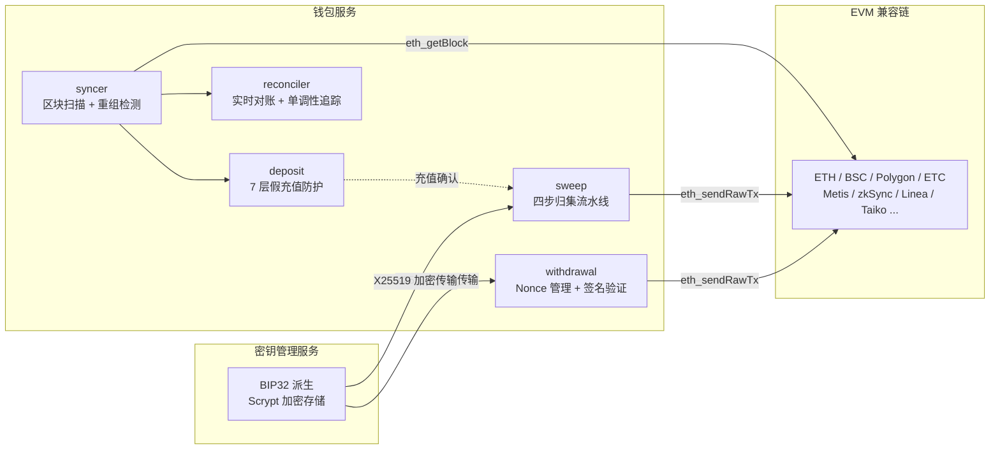

# Exchange Wallet

> 交易所托管钱包系统的完整工程实现——从区块同步、假充值防护、重组回滚到密钥管理，每个模块可独立运行、有测试、有生产差距说明。

## 项目背景

我在交易所做了几年钱包开发，日常维护 60+ 条 EVM 链的充提归集。这个项目把生产中最核心的设计提炼出来，用教学友好的方式重新实现——**不是 copy 生产代码，而是理解后重写**，每个模块都有 notes.md 记录设计决策背后的"为什么"。

**为什么值得看**：面试中被问最多的三个问题——重组怎么处理、假充值怎么防、私钥怎么管——在这个项目里都有可运行的代码和测试来回答。

---

## 30 秒看懂核心亮点

```
区块重组处理（02-block-sync）
  ├── parentHash 逐块校验，检测分叉
  ├── 公共祖先追溯（支持多块深度回滚）
  ├── 7 步原子数据库事务回滚（余额→充值→提现→系统交易→区块头→高度→UTXO）
  └── Front/Back 滑动窗口，深度重组自动暂停 + 告警

假充值 7 层防护（03-deposit）
  ├── Layer 1: Receipt.Status 校验（过滤失败交易）
  ├── Layer 2: Transfer 事件日志校验（签名哈希 + Removed 标记）
  ├── Layer 3: Token 合约地址白名单（精确地址匹配，非 symbol 字符串）
  ├── Layer 4: BlockHash 一致性（防重组期间重复计账）
  ├── Layer 5: 内部交易 Trace 验证（主调用失败→整个作废）
  ├── Layer 6: 交易方向分类（只允许 External→Internal）
  └── Layer 7: 二次校验（独立 RPC 逐字段比对）

密钥管理演进路径（01 + 07）
  ├── 当前：BIP32 派生 + Scrypt 加密存储 + X25519 加密传输 + 四步内存清除
  ├── 问题：主种子单点、完整私钥在钱包进程内存
  └── 演进：MPC 门限签名（CGGMP21/FROST）→ 完整实现见 MPC 学习项目
```

---

## `make simulate` 效果预览

```
╔══════════════════════════════════════════════════════════════╗
║         Exchange Wallet — 端到端全场景模拟                  ║
╚══════════════════════════════════════════════════════════════╝

【场景 01：密钥管理】
  BIP32 硬化推导 / Scrypt+AES 加密 / X25519 加密传输 / 内存清零
  [PASS] (0.47s)

【场景 02：区块同步 + 重组处理】
  parentHash 检测 / 公共祖先追溯 / 7步原子DB回滚 / Front-Back滑动窗口
  → 模拟 5 块正常同步 → 注入 2 块分叉 → 自动检测回滚 → 新链重新同步
  [PASS] (0.39s)

【场景 03：充值 7 层防护】
  Receipt.Status / Transfer事件 / Token白名单 / BlockHash / Trace / 分类 / 二次校验
  [PASS] (0.38s)

【场景 04：提现流程】            [PASS]
【场景 05：归集四步流水线】      [PASS]
【场景 06：对账系统】            [PASS]
【场景 07：MPC 密钥管理】        [PASS]

╔══════════════════════════════════════════════════════════════╗
║  模拟结果：7 通过 / 0 失败                                 ║
╚══════════════════════════════════════════════════════════════╝
```

---

## 项目状态

| 模块 | 阶段 | 测试 | 可用于生产？ |
|------|------|------|-------------|
| 01 密钥管理 | 完整 demo | 7 个测试 | 否（Scrypt 参数简化，缺 HTTP API 层） |
| 02 区块同步 + 重组 | 完整 demo | 4 个测试 | 否（未接真实 RPC，回滚超时硬编码） |
| 03 充值 7 层防护 | 完整 demo | 11 个测试 | 否（缺 Bloom Filter，二次校验简化） |
| 04 提现流程 | 完整 demo | 9 个测试 | 否（本地签名替代远程 ksrv） |
| 05 归集流水线 | 完整 demo | 6 个测试 | 否（补费后未等确认，缺 UnsafeCollect 开关） |
| 06 对账系统 | 完整 demo | 7 个测试 | 否（告警去重在内存，非持久化） |
| 07 MPC 密钥管理 | Shamir demo | 3 个测试 | 否（仅基础构件，完整协议见 MPC 项目） |
| internal/ 基础库 | 可复用 | bigint 有测试 | 是（bigint/coinset 设计可直接用） |

每个模块的 README.md 都有详细的"与生产系统的差距"说明——**知道哪些是 demo、哪些能上线，本身是钱包工程师的核心能力。**

---

## 系统架构



**一套代码支持所有 EVM 链**——链的差异通过 `ChainConfig`（确认数、FeatureGate）参数化：

| 链 | 确认数 | 说明 |
|----|--------|------|
| ETH | 12 | PoS 后相对稳定 |
| BSC | 20 | 出块快，适度保守 |
| Polygon | 400 | 2022 年高度 25280775 深度分叉教训 |
| ETC | 500 | 历史多次 51% 攻击，最深 3693 块 |
| Metis | 1 | Sequencer 机制稳定 |
| zkSync | 5000 | 上线时间短，保守配置 |

---

## 各章节导航

| 章节 | 核心话题 | 代码亮点 | 文档亮点 |
|------|----------|----------|----------|
| [00-architecture](./00-architecture/) | 三层架构、热冷钱包隔离 | — | 架构决策 + 扩展新链指南 |
| [01-key-management](./01-key-management/) | BIP32 + Scrypt + X25519 | 兼容 Web3 Keystore 规范 | 四层安全（存储/传输/鉴权/内存） |
| [02-block-sync](./02-block-sync/) | parentHash 重组 + 7 步回滚 | 模拟重组的完整测试 | 真实分叉案例（Polygon/ETC/BSC） |
| [03-deposit](./03-deposit/) | 7 层假充值防护 | 每层独立攻击测试 | 纵深防御设计哲学 |
| [04-withdrawal](./04-withdrawal/) | Nonce 管理 + EIP-155 | 并发 Nonce 测试 | RBF 加速机制 |
| [05-sweep](./05-sweep/) | 取单→过滤→构建→补费 | Channel 背压控制 | SafeHeight 安全设计 |
| [06-reconciliation](./06-reconciliation/) | 差值单调性 + 去重告警 | 单调性增大/减小测试 | 区分"延迟"vs"bug" |
| [07-mpc-key-management](./07-mpc-key-management/) | Shamir + CGGMP21/FROST | 2-of-3 秘密分享 demo | 传统→MPC 演进路径 |
| [interview-prep](./interview-prep/) | 面试 Q&A + 场景题 + 深挖题 | — | 口语化，可直接对面试官讲 |

---

## 代码复用架构

本项目对应生产钱包系统的两层复用设计：

```
irwallet 层（跨链通用）
  所有链共享，不含链特定逻辑
  → internal/bigint    精确金额（禁止 float64，全部 big.Int）
  → internal/coinset   链类型 + FeatureGate 特性开关
  → internal/alarm     告警接口（Lark/PagerDuty 可插拔）

ethfork 层（EVM 兼容链）
  一套代码支持 ETH/BSC/Polygon/Metis/ETC 等所有 EVM 链
  链差异通过 ChainConfig（确认数、FeatureGate）参数化
  → 01~07 各模块
```

**扩展新 EVM 链**：在 `internal/coinset/chain.go` 新增一行链配置，业务逻辑零修改。

**扩展非 EVM 链**（BTC/SOL/TRON）：实现对应的 `RPCClient` 和交易构建接口，即可复用 irwallet 层全部工具。

详见：[docs/architecture.md](./docs/architecture.md)

---

## 目录结构

```
exchange-wallet/
├── 00-architecture/          系统架构设计（纯文档）
├── 01-key-management/        BIP32 + Scrypt + X25519 + 内存清除
│   └── demo/                 可运行代码 + 测试
├── 02-block-sync/            区块同步 + 重组检测 + 7 步回滚  ★
│   └── demo/                 含模拟重组场景的测试套件
├── 03-deposit/               充值 7 层假充值防护  ★
│   └── demo/                 每层独立攻击测试
├── 04-withdrawal/            提现 Nonce 管理 + 签名验证
│   └── demo/                 并发 Nonce + MaxFee 测试
├── 05-sweep/                 归集四步流水线
│   └── demo/                 SafeHeight + 补费测试
├── 06-reconciliation/        对账 + 差值单调性追踪
│   └── demo/                 单调性 + 去重告警测试
├── 07-mpc-key-management/    MPC 门限签名原理 + Shamir demo
│   └── demo/                 2-of-3 秘密分享
│
├── cmd/keyman/               密钥管理服务骨架（传统 walletmanager）
├── cmd/simulate/             端到端演示（串联 7 个场景）
├── interview-prep/           面试准备（口语化 Q&A + 场景题 + 深挖题）
├── config/                   wallet-dev.yaml + keyman-dev.yaml
├── internal/                 跨链通用基础库（bigint/coinset/alarm）
└── docs/                     数据库 schema + API 设计 + 部署指南
```

每个编号目录内部结构：
```
XX-module/
├── README.md       模块概述 + 生产差距说明
├── goals.md        知识点 L1~L4 分层 + 自检问题
├── notes.md        深度技术笔记（可直接用于面试复习）
└── demo/           可运行 Go 代码 + 测试
```

---

## 快速开始

```bash
git clone https://github.com/yys9517/exchange-wallet
cd exchange-wallet

make test        # 运行全部测试（8 个包，无需 MySQL）
make simulate    # 端到端 7 场景演示
make demo        # 逐个运行各章节 demo
make run-keyman  # 启动密钥管理服务（Ctrl+C 停止，演示优雅关闭 + 密钥清零）
make build       # 编译所有包
```

---

## 密钥管理方案对比

本项目同时展示两种密钥管理方案：**传统 walletmanager**（生产在用）和 **MPC 门限签名**（演进方向）。

### 方案一：传统 walletmanager（cmd/keyman）

独立部署的密钥管理服务，私钥从不离开该进程。完整实现见 [`cmd/keyman/`](./cmd/keyman/) + [`01-key-management/`](./01-key-management/)。

```
安全架构（四层纵深防御）：

存储层    Scrypt(N=2^18) + AES-128-CTR 加密 keystore（兼容 Web3 Keystore V3）
传输层    X25519 ECDH + AES-256-GCM 临时密钥协商（前向安全）
鉴权层    Ed25519 签名 + 时间戳窗口（防重放）
内存层    XOR Mask 保护 + 4步清零（0x00→0xFF→random→0x00）+ runtime.KeepAlive
```

**优势**：实现简单、审计容易、延迟低（单机签名 <1ms）、生产验证充分。

**问题**：主种子单点风险——keystore 文件泄露 + 密码泄露 = 全部资产丢失；完整私钥在进程内存中存在，core dump 可能泄漏。

### 方案二：MPC 门限签名（演进方向）

无单点私钥——密钥在生成时就被分片，任何单个节点都不持有完整私钥。

```
对比：

                    传统 walletmanager          MPC 门限签名（CGGMP21/FROST）
─────────────────────────────────────────────────────────────────────────
私钥形态            完整私钥在单一进程          密钥份额分布在 N 个节点
签名方式            单机 ECDSA 签名            t-of-n 多轮交互签名
单点风险            主种子泄露 = 全部丢失       单个节点被攻破无法签名
运维复杂度          低（单机部署）              高（多节点协调、网络分区处理）
签名延迟            <1ms                       50~200ms（多轮通信）
适用阶段            中小规模、快速上线          大规模资产、合规要求高
```

MPC 方案的完整密码学实现（CGGMP21 精读 + FROST 实现 + Shamir/Paillier/Pedersen 基础构件）在独立项目中：

> [MPC 学习项目](https://github.com/yys9517/mpc-threshold-signature)（Rust/Go）

本项目 [`07-mpc-key-management/`](./07-mpc-key-management/) 是两个项目的桥梁——概述 MPC 原理和演进路径，Shamir 秘密分享的可运行 demo。

### 面试叙事线

> "我在生产中使用传统 walletmanager 方案，四层纵深防御，运行稳定。但我清楚它的单点风险，所以同时在深入学习 MPC 门限签名——CGGMP21 和 FROST 协议都做了精读和实现，准备在合适的时机推动升级。"

---

## 与 MPC 项目的关系

| 项目 | 内容 | 语言 |
|------|------|------|
| **本项目** | 交易所钱包系统（充提归集对账）+ 传统密钥管理完整实现 | Go |
| [MPC 学习项目](https://github.com/yys9517/mpc-threshold-signature) | CGGMP21 协议精读 + FROST Ed25519 实现 + Shamir/Paillier/Pedersen 基础构件 | Rust/Go |

本项目的 01 章是传统密钥管理的**完整实现**，`cmd/keyman` 是可运行的**服务骨架**，07 章是 MPC 的**原理概述**；MPC 项目是密码学协议的**深度实现**。

---

## 技术栈

| 组件 | 版本 | 用途 |
|------|------|------|
| Go | 1.22+ | 全部代码 |
| go-ethereum | v1.14.x | 类型定义、ABI 编码、签名 |
| golang.org/x/crypto | v0.25+ | Scrypt、X25519、AES-GCM |
| MySQL | 8.0 | 生产数据库（测试用内存 mock） |

---

## License

MIT
