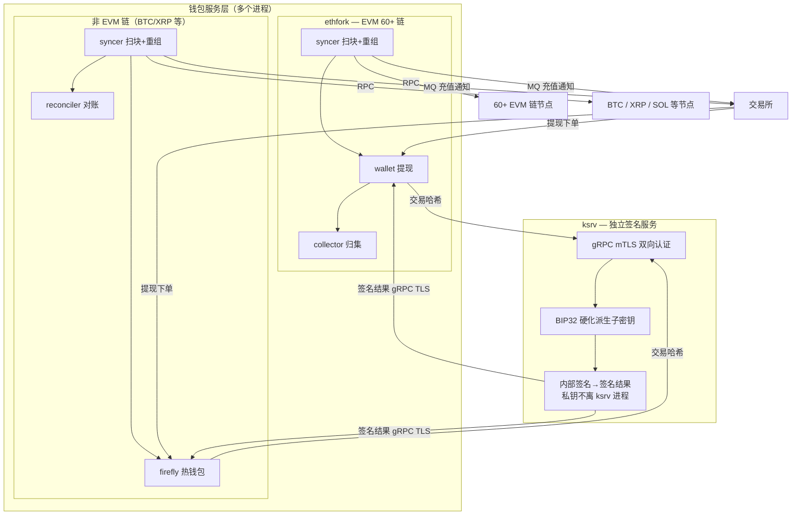
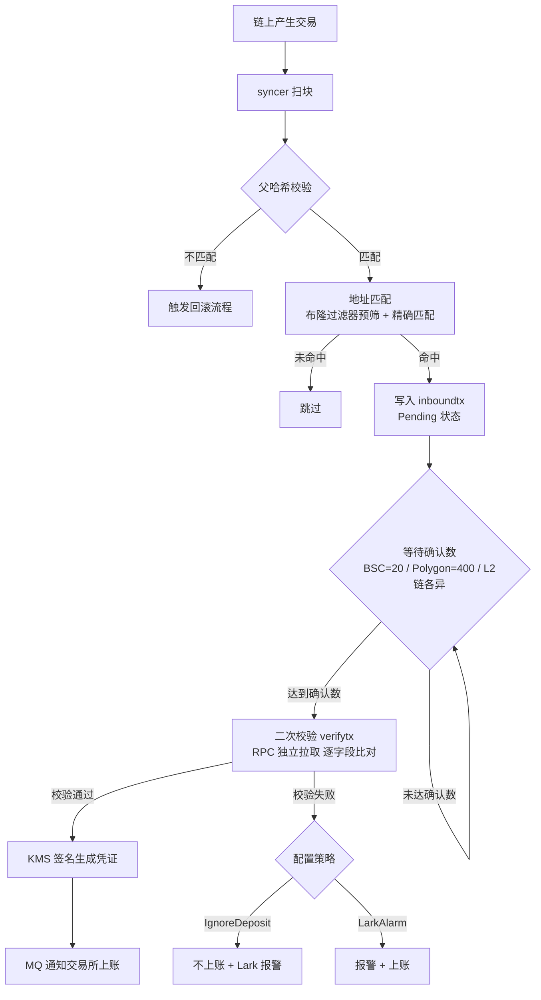
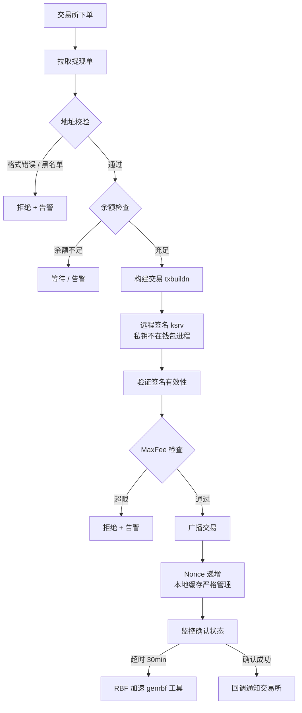
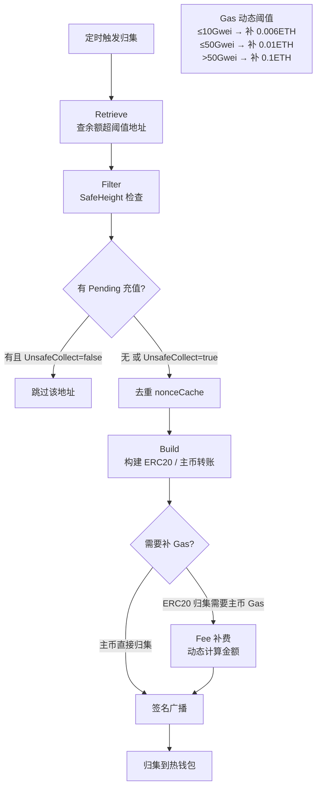
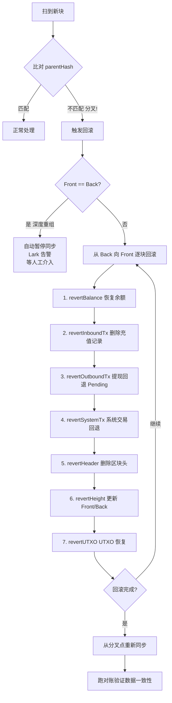
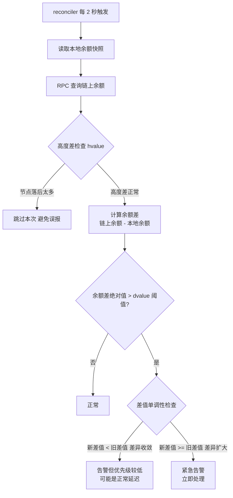
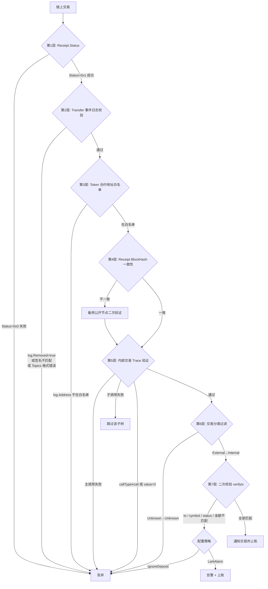
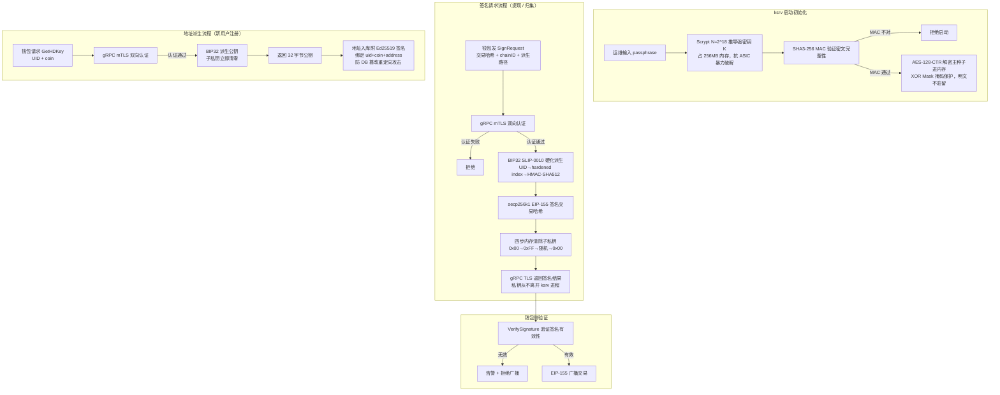

# 钱包岗位面试准备文档

> 基于本项目（exchange-wallet）及其背后的生产经验（ethfork / irwallet / ksrv）整理。口语化第一人称，可直接对照说给面试官听。
>
> 配合使用：每个模块的 `notes.md`（技术深度）+ `goals.md`（知识自检）+ 本文档（面试口语版）。

---

## 第一部分：项目概览（开场白）

**2 分钟项目介绍**

我们做的是一套交易所托管钱包系统。从部署角度看是**两个核心服务对接交易所**：**钱包服务**负责所有链上操作（扫块/充值/提现/归集/对账），**ksrv** 是独立的签名服务。最核心的设计原则是**密钥和钱包逻辑完全分离**：私钥全生命周期在 ksrv 进程里，即使钱包服务被攻破，攻击者也拿不到私钥。

三个角色各自负责什么：

**交易所**：业务方，管用户账本。钱包服务请求获取提现订单，接收充值确认通知上账。

**钱包服务**（实际是多个进程，按链类型分）：
- EVM 链用 **ethfork**，一套代码覆盖 60+ 条 EVM 兼容链（ETH/BSC/Polygon/Arbitrum/zkSync 等），内部有 syncer 扫块+重组检测、wallet 提现执行、collector 归集；链间差异靠 FeatureGate + chaincfg 配置驱动，新增链只加配置文件
- 非 EVM 链（BTC/XRP/SOL 等）各有独立进程，底层共用 **irwallet** 这个**通用代码库**——irwallet 把 UTXO/Account/Tag 三种链类型的公共逻辑（syncer 扫块+重组检测+充值写库、reconciler 2秒实时对账、firefly 热钱包管理）全部抽象出来，各链实现只需适配链特定的 RPC 调用
- 所有钱包进程都只发交易哈希给 ksrv，**不持有私钥**

**ksrv**：独立签名服务。主种子 Scrypt+AES 加密落盘；收到待签名的交易，内部完成 BIP32 派生 + 签名，只把签名结果通过 gRPC TLS 传回，**私钥从不离开 ksrv 进程**。

日常业务四件事：充值（确认后 MQ 通知上账）、提现（签名广播）、归集（散币聚到热钱包）、对账（2 秒一次，偏差立即报警）。



**各角色的分工：**

| 角色 | 组件 | 职责 |
|---|---|---|
| 业务方 | 交易所 | 用户账本；下提现单；接收 MQ 充值通知上账 |
| 钱包服务（EVM） | ethfork | 60+ EVM 链扫块/提现/归集；FeatureGate 配置驱动，新增链只加配置文件 |
| 钱包服务（非EVM） | irwallet 代码库 + 各链进程 | irwallet 抽象 UTXO/Account/Tag 公共逻辑；btcwallet/dogecoinwallet 等各自独立进程 |
| 签名服务 | ksrv | 私钥全生命周期；gRPC TLS 传回签名结果，私钥永不离开 ksrv 进程 |

---

## 第二部分：核心流程图（共 7 个）

### 2.1 充值流程



syncer 拿到新块，第一件事是把新块的 parentHash 和本地 DB 里存的上一块 hash 精确比对，对不上直接触发回滚流程，绝不在可能是分叉链上的交易上做任何处理。通过分叉检测后开始解析这个块里的每笔交易。这里要搞清楚 EVM 主币和 ERC20 在链上的表现是完全不同的，解析方式也不同，但最终都归一到同一个数据结构里传给上层。

主币充值（ETH / BNB / MATIC 等），金额直接在 tx.value 字段，一笔交易产生一个 SimpleTrx。链上 `eth_getTransactionByHash` 返回的原始数据长这样：

```json
{
  "hash":  "0x88df016429689c079f3b2f6ad39fa052532c56795b733da78a91ebe6a713944b",
  "from":  "0xa7d9ddbe1f17865597fbd27ec712455208b6b76d",
  "to":    "0xf02c1c8e6114b1dbe8937a39260b5b0a374432bb",
  "value": "0x6f05b59d3b20000",   // ← 主币金额在这里，0.5 ETH（wei 单位）
  "input": "0x",                  // ← 空，纯转账
  "blockNumber": "0x11e8480"
}
```

解析后归一到内部结构：

```go
MixRetriver{
    Chain: "ETH", Height: 18_908_288, Hash: "0x88df...",
    Executor: "0xa7d9dd...",
    IsSuccess: true,
    List: []*SimpleTrx{
        {Symbol: "ETH", From: "0xa7d9dd...", To: "0xf02c1c...", Value: bigint(500_000_000_000_000_000)},
    },
}
```

ERC20 充值（USDT / USDC 等）完全不同，tx.value 是 0，真实金额藏在 Receipt.Logs 里的 Transfer 事件里。`eth_getTransactionByHash` 返回的交易原始数据：

```json
{
  "hash":  "0xb5c8bd9430b6cc87a0e2fe110ece6bf527fa4f170a4bc8cd032f768fc5219838",
  "from":  "0xa7d9ddbe1f17865597fbd27ec712455208b6b76d",
  "to":    "0xdac17f958d2ee523a2206206994597c13d831ec7",  // ← to 是 USDT 合约地址，不是用户地址
  "value": "0x0",                                        // ← 主币金额为 0
  "input": "0xa9059cbb000000000000000000000000f02c1c8e6114b1dbe8937a39260b5b0a374432bb0000000000000000000000000000000000000000000000000000000005f5e100"
  //         ^^^^^^^^ transfer(address,uint256) 函数选择器
  //                  ^^^^^^^^^^^^^^^^^^^^^^^^^^^^^^^^^^^^^^^^^^^^^^^^^^^^^^^^ to 地址（前12字节补零）
  //                                                                          ^^^^^^^^^^^^^^^^^^^^^^^^^^^^^^^^^^^^^^^^^^^^^^^^^^^^^^^^ 金额 = 0x5f5e100 = 100_000_000 (100 USDT, 6 decimals)
}
```

仅凭交易体看不到金额和真实收款人，必须再拉 `eth_getTransactionReceipt` 看 Logs：

```json
{
  "status": "0x1",
  "logs": [
    {
      "address": "0xdac17f958d2ee523a2206206994597c13d831ec7",  // ← 合约地址，对照白名单
      "topics": [
        "0xddf252ad1be2c89b69c2b068fc378daa952ba7f163c4a11628f55a4df523b3ef",  // Transfer 事件签名
        "0x000000000000000000000000a7d9ddbe1f17865597fbd27ec712455208b6b76d",  // from（32字节，前12字节是padding）
        "0x000000000000000000000000f02c1c8e6114b1dbe8937a39260b5b0a374432bb"   // to（同上）
      ],
      "data": "0x0000000000000000000000000000000000000000000000000000000005f5e100",  // 金额 = 100 USDT
      "removed": false
    }
  ]
}
```

这两份数据不是一次 RPC 拿到的。`eth_getTransactionByHash` 只返回交易体（from/to/value/input），**不包含执行结果**——交易成功还是失败、产生了哪些日志，都在 `eth_getTransactionReceipt` 里。两次 RPC 缺一不可。

拿到 receipt 之后先检查 `receipt.status`。`0x0` 代表失败，EVM 执行触发了 revert，所有状态变更全部回滚，logs 也被清空（失败的交易不产生任何 Transfer 事件）。绝大多数情况直接跳过，但有一个例外：如果是我们系统地址（热钱包 / 归集地址）发起的提现或归集失败了，还是要记录一条 `Failed: true` 的 SimpleTrx——否则这笔失败的系统交易在对账时就变成了"无缘无故消失的手续费"。

`status == 0x1` 之后，还需要做 `receipt.blockHash` 和当前处理 header 的 hash 比对，防止拿到了不属于当前块的 receipt（节点数据不一致时可能发生）。

才进入 `FilterERC20()` 逐条过滤每一个 log。过滤分五步：先检查 `log.Removed`，true 说明链重组这条 log 已撤销，整个交易直接返回重组错误；再检查 `len(log.Topics) != 3 || log.Topics[0] != 0xddf252ad...`，不是标准 Transfer 事件（Approval / Swap / 其他事件）直接 continue 跳过；然后用 `log.Address` 查合约白名单，不在白名单或类型不是 ERC20 跳过（假 USDT 在这里被拦）；接着 `bigint.FromHex(log.Data)` 解析金额，零值跳过，同时验证 Topics[1] / Topics[2] 长度是否等于 EventTopicSize（32 字节 hex = 66 字符），格式不对跳过；五关全过，才做 `sender = "0x" + Topics[1][26:]`，`receiver = "0x" + Topics[2][26:]`（截掉 32 字节里前 12 字节的 zero padding），`tval = log.Data`，生成 SimpleTrx。

```go
MixRetriver{
    Chain: "ETH", Hash: "0xb5c8...",
    Executor: "0xa7d9dd...",  // tx.From，tx.value=0
    IsSuccess: true,
    List: []*SimpleTrx{
        {Symbol: "USDT", From: "0xa7d9dd...", To: "0xf02c1c...", Value: bigint(100_000_000)},
    },
}
```

**燃烧币（Reflection Token / Fee Token）** 是 EVM 代币充值里最麻烦的一类，需要从原理说起。

**原理**：正常 ERC20 的 `transfer(to, 100)` 就是让 to 得到 100 个 token。Reflection Token（反射 / 通缩代币）在合约里加了税——调 `transfer(to, 100)` 时，合约内部悄悄截走一部分（比如 5%），to 实际只收到 95，被截的 5 进了销毁地址或按比例分给所有持有者。关键在于：**这 5 个被截走的 token 没有独立的 Transfer 事件**，receipt.Logs 里只有一条 Transfer 显示 to 收到了 95，看不到那 5 的去向——这就是 codebase 里命名 `TokenFeeWithoutEvent` 的含义。另一种变体 `TokenFeeWithTransferEvents` 则会在 logs 里额外产生一条 Transfer 到 burn/fee 地址，两者处理方式不同。

**经典例子**：BSC 链上的 SafeMoon（SAFEMOON）是这类代币的鼻祖，10% 转账税（5% 销毁 + 5% 分红），BRISE（Bitgert 链）同理。BSC 链上大量"BABY" / "FLOKI" 系 BEP20 都是这个模式。代码里 `badERC20` map 里的 TOPC、BAR/ACM/PSG（CHZ 链足球粉丝代币）则是另一类问题：合约 `transfer()` 永远返回 false 即使成功了，不是燃烧机制。

**问题在哪**：

充值（用户发 100 SafeMoon 进来）：receipt.Logs 里 to=用户地址 的 Transfer 显示收到 95，就上账 95，这是正确的——用户存了多少，我们就上多少。

提现（用户要提走 100 SafeMoon）：系统调 `transfer(userAddr, 100)`，userAddr 只收到 95，但用户账本必须扣 100（用户要求提 100，不能只扣 95，否则用户可以循环套利），receipt.Logs 显示的是 95。

归集（把用户充值地址的 SafeMoon 归到热钱包）：系统调 `transfer(hotWallet, 100)`，热钱包实际进账 95，这 5 被销毁了。如果账本只记热钱包进了 95 但扣了用户地址 100，对账永远差 5。

**解法**：提现和归集需要知道"原始 input 金额"。`tx.input` 里的 `transfer(to, amount)` 的 `amount` 参数就是调用方填进去的，截取 `trx.Input[74:]` 就能拿到——这个是"发出去多少"，log.Data 是"收到多少"，两者之差是被销毁的部分。

充值路径不需要特殊处理（只有系统地址才触发特殊逻辑）。提现路径：`tval(log.Data) != actualValue(input[74:])` 时把账本记录更新为 actualValue，保证用户扣的是提走的原始量。归集路径：`tval < actualValue` 时额外生成一条 `To=FeeBurnAddress` 的 SimpleTrx，记录销毁量，热钱包入账 tval，销毁记 burned，总和等于 actualValue，对账不会出差。

对于 `TokenFeeWithTransferEvents`（如某些 fee-on-transfer token，burn 有独立 event）：提现时直接用 `tx.input[74:]` 的 amount 上账（不依赖 logs），归集时则先走 `FilterERC20` 拿所有 Transfer 事件，把系统地址的入账累加后和 input amount 比，差值同样记 FEE_BURN。

对于 `badERC20`（TOPC、CHZ 链足球代币 BAR/ACM/PSG 等）：问题不在充值，在提现构建时——`CallContract` 预检会拿到 false 返回值，正常逻辑会以为 transfer 会失败而拒绝广播。解法是把这些 token 配置进 `badERC20` map，设 `NoResCheck=true`，跳过返回值检查。充值解析逻辑完全不受影响，因为充值看的是 receipt.Logs，不是 callContract 的返回值。

这几类特殊 token 对 **对账** 的影响：FEE_BURN 记录的存在让每笔燃烧都有账可查，reconciler 比对链上余额和本地账本时不会出现系统性偏差。如果没有 FEE_BURN，每归集一笔 SafeMoon 热钱包就会少 5%，对账永远报警。

Solana 的结构和 EVM 完全不同。SOL 原生币转账在 SystemProgram.Transfer 指令里；SPL Token（Solana 上的 USDC/USDT 等）的转账在 TokenProgram.Transfer / TransferChecked 指令里，to 地址是 Associated Token Account（ATA），需要反推出背后的真实持有者地址。一笔 Solana 交易可以包含多个 Instructions，每个可能是一条转账，底层解析方式和 EVM 的 Receipt.Logs 完全不同，但同样归一到 MixRetriver → SimpleTrx 结构，上层 syncer 处理逻辑对链类型透明。

地址匹配用布隆过滤器先快速筛（百万地址规模 O(1)，只有假阳性无假阴性），命中了再精确查 DB，没命中直接跳过。匹配到就写 inboundtx 表，状态 Pending，记 txid / from / to / amount / blockHeight。

之后进入等待确认阶段，[Front, Back] 滑动窗口计数，到达配置的确认数（BSC=20，Polygon=400——这些数字是根据各链历史分叉深度单独配的，Polygon 400 是 2022 年真实深度分叉后调上去的），Front++ 推进安全高度，触发 verifytx 二次校验。二次校验从另一个独立 RPC 节点重新拉这笔交易，逐字段比对 to / symbol / IsSuccess / 金额（FuzzyCompare 处理微小差异）。校验通过后把 {symbol, txid, to+tag, amount} 序列化成 proto，用 KMS 私钥签名，随充值记录推 MQ 通知交易所上账；校验失败按配置走 IgnoreDeposit（不上账 + 告警）或 LarkAlarm（告警但上账）。

---

### 2.2 提现流程



提现的核心原则是私钥永远不在钱包进程里，整条链路都围绕这一点设计。

拉到提现单，第一关是地址校验。格式检查之后做黑名单匹配，黑名单来自独立的远程黑名单服务而不是本地数据库——钱包持有这个服务的 HTTP baseURL 和 Ed25519 公钥，启动时拉一次缓存到本地 map[string]struct{} 里，后台 goroutine 每分钟刷新，mutex 保护并发读。HTTP 响应服务端附 Ed25519 签名（对 proto.Marshal({total, list, timestamp}) 签名），钱包验签 + 校验时间戳在 15 秒窗口内防重放，拉到空列表但签名不合法直接拒绝，防止中间人清空黑名单放行所有地址。

地址校验过了，第二关是余额和 MaxFee 检查。热钱包余额不足等待告警；构建完交易后算 Gas Price × Gas Limit 预估费，和 maxFeeGwei 配置比，超限直接拒绝广播，防止网络拥堵时扛着高 Gas 把提现发出去。

第三关是 ksrv 远程签名。钱包只发 SignRequest{txHash, chainID, derivePath} 通过 gRPC mTLS，ksrv 内部 BIP32 SLIP-0010 硬化路径派生子私钥，secp256k1 + EIP-155 签名，签完四步清零子私钥，只返回 65 字节签名结果。钱包收到后调 VerifySignature 验签，确认签出的确实是自己构建的那笔交易，无效告警拒绝广播，这一步防止 ksrv 被攻击者控制后签出非预期交易。

ERC20 提现有额外的注意点：tx.value=0，data 是 ABI 编码的 transfer(to_addr, amount)，tx.to 是合约地址不是用户地址。构建时先 EstimateGas 预估 gas limit，再 CallContract 干调用一次验证合约不会 revert——有些问题合约不抛异常而是静默返回 false，预检能在广播前发现，而不是等上链后才知道失败。燃烧币（Burnable=true）gas limit 额外 +2×MinGas，因为合约内部有多步销毁操作。

第四关是 Nonce 管理，本地缓存严格递增，启动时从 DB 加载记录值不依赖节点状态，Filter 阶段 nonceCache 防并发构建用同一个 Nonce，广播成功后 +1 写回 DB。广播后持续监控确认，超 30 分钟未确认告警，可用 genrbf 工具同 Nonce 提高 Gas Price 做 RBF 加速，上限 maxRBFGasP=200。

---

### 2.3 归集流程



归集是四步 channel 流水线，每步独立 goroutine 通过 channel 串联，全程 context 控制取消。

Retrieve 这步先优先拉 Token 列表，再拉主币——代码里就是先遍历 chain.Token()，再查主币，所以 ERC20 归集比主币归集优先触发。每个 Token 独立配置 Collectable 阈值，只有余额超阈值的地址才返回，每次最多 150 条分批。disabled.Aggregation 可以给单个 Token 关掉归集开关不影响其他 Token。

Filter 做安全检查。先查 SafeHeight，保证只对安全高度以下已确认的充值做归集。然后每个地址查两件事：HasPendingInbound（有未确认充值在途）和 AnyPendingSystemtx（有归集单或补费单在途），任一有就跳过，防止归集和充值确认时序冲突以及同一地址 Nonce 冲突。notPending / isPending 两个 map 做本地缓存，同一地址只查一次 DB。Token 还有 MaxColl 上限配置，超出上限只归集上限量，防止单次归集量过大。

Build 是核心，ERC20 和主币处理路径不同。ERC20 归集先查这个地址当前的主币余额（RealTimeBalance），因为 ERC20 transfer 的 tx.value=0，data=ABI.encode(transfer(热钱包地址, amount))，但发交易需要主币支付 Gas。预估 Gas 后算 costFee = gasLimit × gasPrice，如果 costFee > AddrEther 就把这个地址发到补 Gas 队列（fchan），先不归集 Token，等补完 Gas 再说。燃烧币（TokenFeeWithoutEvent）归集时 gas limit 额外 +2×MinGas，因为合约内部有销毁操作，不多加容易 OOG。主币归集更直接，转主币剩余量到热钱包，但如果同一地址同时有 ERC20 归集，归集主币时要先把 ERC20 那笔预留的 Gas 费扣掉，AddrEtherCache 维护了这个减法。

补 Gas 金额动态计算：Gas Price ≤10Gwei 补 0.006 ETH，≤50Gwei 补 0.01 ETH，>50Gwei 补 0.1 ETH，Gas 越贵补越多，防止补进去的 Gas 又被高 Gas 费吃掉还不够用。

---

### 2.4 区块重组检测与回滚流程



每扫到新块，第一件事是拿新块的 parentHash 和本地 DB 里存的上一块 hash 精确比对，不一致说明链发生了分叉，立刻停止处理新块进入回滚流程。

系统维护 [Front, Back] 滑动窗口，Back 每扫一个新块 +1，Front 是安全高度（每当充值达到确认数 Front++）。回滚从 Back 往 Front 方向逐块走，每块执行 7 步原子事务：① revertBalance 恢复余额 → ② revertInboundTx 删充值记录 → ③ revertOutboundTx 提现回 Pending → ④ revertSystemTx 系统交易回 Pending → ⑤ revertHeader 删区块头 → ⑥ revertHeight 更新 Front/Back → ⑦ revertUTXO 恢复 UTXO 状态（UTXO 链专用）。7 步全部在一个 DB 事务里提交，要么全成功要么全回滚，不会出现中间状态。

当 Front == Back 时，说明连安全区都被分叉覆盖了，超出系统自动处理能力，自动暂停同步，发 Lark 紧急告警，等人工介入评估已上账充值是否需要协调交易所撤销，逐步恢复数据后跑对账验证一致性才重启同步。Polygon 2022 年真实发生过深度分叉，我们事后把 Polygon 确认数调到了 400，这个数字背后是真实教训。

---

### 2.5 对账流程



对账每 2 秒跑一次，实时的，不是批量定时任务。

每轮先做高度差检查：比较节点报告的链上最新高度和本地同步高度，差值超过 hvalue（可配）就跳过这轮，节点数据不可信不做对账，防止把节点落后误报成余额异常。高度差正常才往下走。

读本地余额快照（syncer 同步时维护在 DB），RPC 查链上余额，算 diff = 链上余额 - 本地余额，绝对值超过 dvalue 阈值（按 Token 独立配置）才触发告警，Gas 费微小误差不告警。

关键是单调性判断：记录上一轮 prevDiff，和这轮 newDiff 比较。newDiff < prevDiff 说明差值在收敛，可能是 Pending 交易还没被确认进账，级别低的告警；newDiff >= prevDiff 说明差值在持续扩大，是真正的异常，紧急告警立刻处理。两种情况如果一刀切统一告警，正常的处理延迟会淹没真实告警，所以要区分开来。

---

### 2.6 假充值防护链路（7 层防线）



7 层防线是充值安全的核心，每层是独立的拦截点，全部过了才上账。第一层 Receipt.Status 检查，0x0 直接丢，这是最基础的门。第二层解析 ERC20 Transfer 事件日志：log.Removed 必须 false（重组撤销的日志不算），Topics[0] 必须是 Transfer 事件签名 0xddf252ad...，Topics 长度必须 3，格式错误直接丢。第三层是 Token 合约地址白名单，精确地址匹配不是 symbol 字符串匹配，假 USDT 合约地址不在白名单，在这层直接拦住，不会产生任何充值记录。第四层是 Receipt BlockHash 一致性校验，receipt.BlockHash 和 header.Hash 对不上，切备用公开节点重新验证。第五层是内部交易 Trace 验证，主币内部转账用 debug_traceTransaction 解析调用树，主调用失败整个作废，子调用失败跳过子树，callType 必须是 call 且 value>0 才算有效转账。第六层是交易分类过滤，充值必须是 External→Internal 方向，Unknown→Unknown 直接过滤。第七层是通知交易所前最后的 verifytx 二次校验，独立从另一个 RPC 节点重新拉交易，逐字段比对 to / symbol / IsSuccess / 金额，FuzzyCompare 处理手续费微小差异，失败按配置走 IgnoreDeposit 或 LarkAlarm。

---

### 2.7 密钥管理与分发流程



ksrv 和钱包服务是完全分离的两个进程，私钥的每一次使用都在 ksrv 进程内部完成。

存储层：主种子用 Scrypt（N=2^18，每次 KDF 需要 256MB 内存，抗 ASIC 暴力破解）加 AES-128-CTR 加密落盘，SHA3-256 MAC 防篡改。启动时运维输入 passphrase，Scrypt 现算密钥解密主种子进内存，立刻用 XOR Mask 掩码保护——主种子 XOR 随机 mask 分成两块分别存，需要用时临时还原，用完立刻清零，明文不常驻内存。

签名层是核心：钱包只发 SignRequest{txHash, chainID, derivePath}，通过 gRPC mTLS 双向认证建立安全信道（双方各持证书互相验证）；ksrv 内部用 BIP32 SLIP-0010 硬化路径派生对应子私钥，secp256k1 + EIP-155 完成签名，子私钥四步内存清除（0x00→0xFF→随机→0x00，+runtime.KeepAlive 防编译器优化掉清零操作），只把 65 字节签名结果通过 gRPC TLS 传回。私钥从不离开 ksrv 进程。

钱包收到签名后调 VerifySignature 验证签名是否对自己构建的那笔交易有效，无效告警拒绝广播，防止 ksrv 被攻击者控制后签出非预期交易。

地址派生：新用户注册时，钱包用 UID 作为 BIP32 hardened index 请求 GetHDKey，ksrv 只返回公钥（子私钥派生后立即清零），地址入库时附 ksrv 的 Ed25519 签名（绑定 uid+coin+address），每次查地址都验签，防止 DB 被篡改后充值打到攻击者地址。

---

## 第三部分：高频面试问答（共 18 题）

### Q1：区块重组怎么处理？

**回答**：

区块重组这块我们做得比较扎实。每次扫新块，都会拿新块的 parentHash 和本地数据库里存的上一块 hash 做比较。一旦对不上，就知道链发生了分叉，立刻触发回滚。

回滚是 7 步数据库事务，按顺序来：恢复余额、删充值记录、把提现和系统交易回退到 Pending 状态、删区块头、更新滑动窗口指针、UTXO 链还要恢复 UTXO 状态。全部在一个事务里，要么全成功要么全回滚，不会出现中间状态。

我们有一个 [Front, Back] 的滑动窗口，Front 是安全高度，Back 是当前同步到的高度。如果回滚一直回滚到 Front == Back，说明连安全区都被重组了，系统自动暂停，发 Lark 告警，等人工来处理。

不同链确认数差异很大——BSC 设的 20，Polygon 设的 400，ETC 设的 500，L2 链各不相同，从 1（Metis）到 5000（zkSync）不等，每条链根据安全模型独立配置。

**如果追问**：为什么 Polygon 要设 400 这么高？

2022 年 Polygon 真实发生过深度分叉，高度 25280775 附近，分叉深度超过了当时的确认数配置。我们针对这个事件做了专项处理和预案，事后把 Polygon 的确认数调高到了 400。这个数字背后是真实教训，不是拍脑袋定的。

---

### Q2：如何防止双花？

**回答**：

防双花我们有几层联动机制。

第一是确认数，充值必须等足够多的块确认才上账，在这个深度内攻击者很难发动成功的双花攻击。

第二是 SafeHeight，归集和对账都基于 SafeHeight，只对安全高度以下的交易操作，不碰还没确认的。

第三是充值二次校验，达到确认数后、通知交易所前，重新从 RPC 独立拉一次交易数据，逐字段比对，确保这笔交易在链上是稳定的。

第四是提现侧的 Nonce 严格递增加 EIP-155，Nonce 由本地缓存严格管理，EIP-155 把链 ID 编进签名里，一条链上的交易拿到另一条链上直接失效，防跨链重放。

第五是回滚和对账联动，如果真的发生了回滚，对账系统会立刻发现余额偏差并告警。

**如果追问**：RBF 双花怎么处理？

RBF 是 UTXO 模型里的机制，交易发出去后如果标记了 RBF 可替换，矿工费出价更高的新交易可以替换掉旧的。对充值侧，确认数是主要防线——等足够多的确认之后，RBF 已经不可能成功了。对提现侧，我们有 genrbf 工具可以主动做 RBF 加速，但有 maxRBFGasP=200 的上限，防止无限加价。

---

### Q3：私钥怎么管理？安全措施有哪些？

**回答**：

私钥管理是整套系统的核心，基本思路是密钥管理和钱包服务完全分离，私钥永远不在钱包进程的内存里存在。

存储层：主种子用 Scrypt 做 KDF，N 设到 2^18（约 26 万次迭代），AES-128-CTR 加密，再加 SHA3-256 的 MAC 防篡改。

传输层：钱包进程只发待签名的交易哈希，ksrv 内部完成 BIP32 派生 + 签名，gRPC mTLS 双向认证 + TLS 加密传回签名结果。**私钥从不离开 ksrv 进程**，网络上传输的是签名，不是私钥。

鉴权层：gRPC mTLS 双向证书认证，ksrv 只允许持有合法证书的钱包服务访问，内网私有 IP + 防火墙双重隔离。

内存层：私钥用完之后四步清除——0x00、0xFF、随机字节、再 0x00，防冷启动攻击。运行时还用 XOR 掩码隐藏敏感数据在内存中的真实值。

**如果追问**：密钥管理服务被攻破怎么办？

这是当前架构存在的单点问题——主种子集中存储。ksrv 本身没有链上操作能力，但被攻破了攻击者可以控制签名，对任意交易签名。所有 API 请求都有签名验证和日志记录，异常访问会触发告警。这也是我业余时间做 MPC PoC 的动机，想验证分布式密钥方案的可行性，把单点问题从根上解决掉。

---

### Q4：充值流程的安全细节？

**回答**：

充值安全做了很多层。

地址匹配这块，布隆过滤器先快速过滤，命中了才做精确匹配，O(1) 时间复杂度，扫块速度快，不因地址量大而变慢。

充值记录这块，先写成 Pending 状态，等足够的确认数才处理，不会因为一个未确认交易就上账。

假充值防护这块，核心是 7 层防线（详见 Q16），覆盖了 Status 检查、Transfer 事件校验、合约白名单、BlockHash 一致性、内部交易 Trace、交易分类过滤、最后的二次校验。

最小充值金额和黑名单也有配置，超小额的直接过滤，黑名单地址直接拒绝。

**如果追问**：节点返回假数据怎么办？

第 4 层的 BlockHash 一致性检查针对这个——发现 receipt 的 BlockHash 和当前处理的 header hash 不一致，就切到备用的公开节点重新验证。最后的二次校验 verifytx 也是独立的 RPC 请求，syncer 和验证用的是不同的节点。两个独立节点都返回假数据的情况下，会触发 Lark 告警，人工介入。

---

### Q5：提现流程怎么保证安全？

**回答**：

提现安全主要靠几道关卡串联。

地址校验：格式检查、黑名单匹配。黑名单从独立的远程黑名单服务拉取（HTTP API），本地内存缓存每分钟刷新；响应带 Ed25519 签名，钱包服务验签 + 时间戳校验（15 秒窗口），防止中间人篡改响应或重放旧列表。

余额检查：提现前确认热钱包余额够用。

MaxFee 限制：构建完交易之后算矿工费，超过上限就拒绝广播，防止 Gas 暴涨时被坑。

远程签名：发给 ksrv 服务签名，签完还要验证签名有效性，确保签出来的是合法交易。

Nonce 管理：本地缓存 Nonce 严格递增，启动时从数据库加载上次记录的 Nonce，Filter 里用 nonceCache 防并发。

广播后监控确认状态，超 30 分钟未确认就告警，可以考虑 RBF 加速。

**如果追问**：提现一直 pending 怎么处理？

先排查原因：可能是 Gas Price 设太低了，当时网络拥堵了。确认是 Gas 问题后，用 genrbf 工具生成替换交易，提高 Gas Price，重新签名广播。genrbf 有 maxRBFGasP=200 的上限，不会无限加。

---

### Q6：归集怎么做的？有什么安全考虑？

**回答**：

归集是四步流水线：Retrieve、Filter、Build、Fee。

Retrieve：查余额超阈值的地址，超了才归集，防止频繁小额归集浪费 Gas。

Filter：两个关键安全检查——SafeHeight 保证只归集已确认的充值，如果地址还有 Pending 充值就先跳过，防止归集和充值确认时序冲突。UnsafeCollect 开关默认关闭，特殊场景才由运维手动打开。

Build：构建转账交易，ERC20 和主币分别处理。

Fee：ERC20 归集前检查地址有没有主币，没有就补一笔 Gas。补多少动态计算：Gas Price ≤10Gwei 补 0.006 ETH，≤50Gwei 补 0.01 ETH，>50Gwei 补 0.1 ETH。

**如果追问**：Gas Price 暴涨怎么办？

两个机制：MaxFee 检查，Gas 费超上限就不归集，等价格回落；KeepETH 配置，归集主币时保留最小余额，确保地址上还有 Gas 费可以处理后续交易。

---

### Q7：对账系统怎么设计的？

**回答**：

对账是实时的，每 2 秒跑一次，不是批量定时任务那种。

流程是：reconciler 读取同步器推过来的本地余额快照，然后 RPC 查链上余额，先做高度差检查——节点高度落后太多，说明节点数据不可信，跳过这轮，避免误报。高度差正常了才做余额对比，差值超过 dvalue 阈值就告警。

我们还追踪差值的单调性：新差值比旧差值小，说明差异在收敛，可能是正常的处理延迟；差值持续扩大，就是真正的问题，要立刻处理。这两种情况要区别对待，不能一刀切。

**如果追问**：发现差异怎么排查？

排查顺序：先看高度是不是同步的，高度差太大就等；然后看有没有 Pending 的提现在途，在途金额可能就是差值的来源；再查最近几笔充值、提现的记录，逐笔比对；如果还对不上，看看有没有链上的内部交易没被追踪到，trace_block 重新扫一遍。

---

### Q8：Nonce 管理怎么做？有没有遇到过 Nonce 问题？

**回答**：

Nonce 我们是本地缓存管理，启动时从数据库加载上次记录的 Nonce，不是每次启动都从 RPC 查——这样更快，也不依赖节点状态。每次广播一笔交易就 +1，本地严格维护。workorder 工具处理 RECOVER 等特殊场景时会从 RPC 同步一次 Nonce，日常提现走数据库加载。

关键是严格串行，Filter 阶段有 nonceCache 防止并发构建交易用同一个 Nonce——Nonce 冲突的话矿工只会接受一笔，另一笔就丢了或者被替换。

Nonce 卡住的情况也处理过——Gas 设太低导致交易一直 pending，后续的 Nonce 都被卡住了。处理方式是用 genrbf 对卡住的那笔做 RBF，提高 Gas Price，让它先确认，后面的队列才能继续动。

**如果追问**：多个服务同时发交易 Nonce 冲突怎么办？

设计上就是单点发送，提现由 wallet 进程串行处理，不允许多个进程同时往同一个热钱包地址发交易。如果真的要多热钱包并行，就给每个热钱包独立的 Nonce 管理，互不干扰。

---

### Q9：多链架构怎么设计的？怎么适配不同链的差异？

**回答**：

我们把链抽象成三种类型：UTXO 型（BTC、LTC）、账户型（ETH、TRON）、Tag 型（XRP、XLM，需要 memo 标签区分用户）。irwallet 是一个**通用代码库**，把这三种类型的公共逻辑（扫块、重组检测、充值写库、对账、热钱包）全部抽象出来，各链的钱包进程引用它、适配链特定的 RPC 调用，不需要重复实现核心逻辑。

EVM 链统一用 ethfork 一个服务搞定，支持 60+ 条链，链间差异用 FeatureGate 控制——有些链需要特殊 Gas 计算、有些用 Secp256r1 签名（ABIoT）、有些从浏览器 API 拉内部交易（SGB/Flare）。每条链的确认数、Gas 参数、签名算法、RPC 节点都在 chaincfg 里独立配置，新增一条 EVM 链基本就是加配置文件，不需要改核心代码。

**如果追问**：新增一条链要做什么？

如果是 EVM 链，就在 chaincfg 里加配置：确认数、chainID、Gas 参数、RPC 节点、特性开关。然后部署节点，做一次充值提现测试，validator 启动时会链上验证 Token 配置是否正确。如果是非 EVM 链，要基于 irwallet 代码库实现对应链的 RPC 适配、签名逻辑，打包成独立进程部署，工作量大一些。

---

### Q10：监控告警体系怎么做的？

**回答**：

我们的告警分五个维度：同步告警（深度重组、RPC 故障、同步超时）、充提告警（未知地址大额充值、处理失败、二次校验失败）、高度监控（节点冻结超 600 秒、落后超 100 块、持续两小时偶发错误）、对账告警（余额偏差超阈值）、配置变更告警。

通知渠道是 Lark 和钉钉机器人，通过 watchandnotify 模块推送。

有一个告警去重机制——45 分钟内同内容的告警只发一次，防止告警风暴把人淹没。但不是简单的 45 分钟静默，是内容哈希匹配，同一个问题的重复告警压制，不同问题不影响。

**如果追问**：半夜收到告警怎么处理？

先看告警级别，深度重组、对账差值扩大这类是紧急的，要立刻处理；节点轻微落后、偶发 RPC 错误这类可以等到白天。处理思路是：先恢复服务（切备用节点、重启进程）再查根因，不要在半夜花时间排查根因。

---

### Q11：热钱包和冷钱包怎么隔离的？

**回答**：

三层架构：ksrv 管密钥，icelake 是冷钱包（低频操作，高安全），warm 是热钱包（高频，便利性更高）。

隔离是通过密钥管理层做到的——钱包进程只发交易哈希给 ksrv，ksrv 内部完成 BIP32 派生 + 签名，gRPC TLS 传回签名结果，私钥从不离开 ksrv 进程。签名完成后钱包还要验证签名有效性才广播，二次确认。

冷钱包的 API 接口有额外的认证，操作频率低，只在需要补充热钱包余额时才动。

**如果追问**：热钱包余额管理策略？

热钱包维持一个目标余额区间，低于下限就从冷钱包（icelake）补充，高于上限就归到冷钱包。归集是热钱包的主要补充来源——充值地址的散币归集后先进热钱包，归集阈值可配，ERC20 归集还有动态 Gas 补费（Gas Price ≤10Gwei 补 0.006 ETH，≤50Gwei 补 0.01 ETH，>50Gwei 补 0.1 ETH）。另外 KeepETH 配置保证归集主币时地址上保留最小余额，防止地址彻底清空后没 Gas 处理后续充值。整体策略是：热钱包够用就不动冷钱包，冷钱包是最后的资金池。

---

### Q12：EIP-155 是什么？为什么重要？

**回答**：

EIP-155 是以太坊的跨链重放保护方案，核心就是在签名里加入 chainID。签名的数据里包含了 v = chainID * 2 + 35 这个值，这样同一笔交易的签名在不同链上是无效的。

对我们来说很重要，因为支持 60+ 条 EVM 链，如果不做 EIP-155，一条链上签出来的交易可以被拿到另一条链上广播，造成资产损失。我们所有提现交易都强制 EIP-155，签名时带上对应链的 chainID。

**如果追问**：不做 EIP-155 会怎样？

早期以太坊没有 EIP-155 的时候，ETC 和 ETH 分叉后，ETH 上的交易可以直接在 ETC 上重放，造成了资产损失。我们跑 60+ 条链，如果 BSC 上的提现可以在 Polygon 上重放，攻击者拿到一笔提现的签名就能在多条链上重放，损失成倍扩大。

---

### Q13：如何处理 ERC20 Token 充值？和主币有什么区别？

**回答**：

ERC20 充值和主币充值在链上的表现完全不同。主币转账就是 tx.value，在交易本身就能看到。ERC20 转账的 tx.value 是 0，真正的金额在 Receipt.Logs 里的 Transfer 事件里。

我们的做法是解析每一个 log，找到 Transfer 事件签名 `0xddf252ad...`，从 Topics 里取 from 和 to 地址，从 log.Data 里取金额，再按 Token 的 decimals 转换成实际数值。

合约地址白名单是关键——必须是配置的合法合约地址发出的 Transfer 事件才算充值，精度处理上全部用 big.Int 做运算，不用 float64，防止精度丢失。

**如果追问**：假 Token 攻击怎么防？

合约地址精确匹配。攻击者可以部署一个 symbol 也叫 USDT、decimals 也是 6 的假合约，但合约地址不是配置的那个地址，Transfer 事件里的 log.Address 对不上，直接被第 3 层过滤掉，不会产生任何充值记录。

---

### Q14：遇到过什么线上事故或高风险场景？怎么处理的？

**回答**：

最典型的是 Polygon 深度分叉的预案处理。2022 年 Polygon 在高度 25280775 附近发生了深度分叉，我们针对这类场景做了专项预案和处理流程。

处理思路是：先暂停同步（防止继续在错误的链上处理交易），然后评估影响范围（哪些充值单是在分叉块范围内产生的，哪些提现受到了影响），按回滚事务逐步恢复数据（余额、充值记录、提现状态），重算余额，跑对账验证链上链下一致，最后才恢复同步。

事后复盘，把 Polygon 的确认数提高到了 400，这个数字是有依据的。

**如果追问**：怎么保证回滚数据正确性？

7 步回滚事务是原子的，要么全成功要么全回滚，不会出现中间状态。回滚完成后跑对账，链上余额和本地余额要匹配，不匹配就继续排查。每一步都有日志，可以追溯每个 block 的回滚过程。

---

### Q15：RBF 怎么处理？

**回答**：

我们有 genrbf 工具专门做这个。当提现交易卡住（Gas Price 设低了，网络拥堵超过 30 分钟没确认），就用 genrbf 生成一笔替换交易——用同一个 Nonce，提高 Gas Price，重新签名广播。矿工会优先打包费用更高的同 Nonce 交易，原来那笔就被替换掉了。

有个 maxRBFGasP=200 的上限，Gas Price 不会无限加，防止费用失控。

**如果追问**：什么时候需要用 RBF？

主要是 Gas Price 暴涨场景，当时发出去的交易费用不够，矿工不理睬。另外就是 Nonce 卡住了，前面有一笔迟迟不确认，后面的都被堵着，用 RBF 把卡住的那笔加速，整个队列才能继续动。

---

### Q16：假充值怎么防？（重点题）

> **面试节奏提示**：先用 30 秒概括"我们做了 7 层防护，从 Receipt 状态检查到最终的二次校验"，然后重点展开第 1 层（Status）、第 3 层（合约白名单）、第 7 层（二次校验）这三个最有说服力的层，其余四层等面试官追问再展开。全部展开需要 5-8 分钟，不要一次性倒完。

**回答**：

这是钱包安全里最核心的问题，我们做了 7 层防护，从 Receipt 状态检查到最终的二次校验，7 层全过了才上账。重点讲三层：第 1 层 Status 检查是最基础的门槛；第 3 层合约地址白名单直接干掉假 Token 攻击；第 7 层二次校验是通知交易所前的最后一道防线。

**第 1 层 Receipt Status 检查**：只有 Status=0x1 才算成功，0x0 直接丢。这是最基础的，防失败交易被当成充值。

**第 2 层 Transfer 事件日志校验**：ERC20 充值看 Receipt.Logs，不看 tx.value。校验点：log.Removed 必须为 false（防重组撤销的日志），事件签名必须是标准 Transfer 的 keccak256 哈希 `0xddf252ad...`，Topics 必须 3 个且格式正确，金额从 log.Data 解析。

**第 3 层 Token 合约地址白名单**：精确地址匹配，不是看 symbol 字符串。启动时还链上验证——调合约的 symbol() 和 decimals()，确认和配置一致。

**第 4 层 BlockHash 一致性检查**：receipt.BlockHash 和当前处理的 header.Hash 比对，不一致就从备用公开节点重新验证。

**第 5 层 内部交易 Trace 验证**：主币的内部转账用 debug_traceTransaction 获取调用链，主调用失败整个作废，子调用失败跳过子树，callType 必须是 call 且 value>0。

**第 6 层 交易分类过滤**：充值必须是 External→Internal 方向，Unknown→Unknown 的直接过滤。

**第 7 层 二次校验 verifytx**：达到确认数后、通知交易所前，独立从 RPC 重新拉交易，逐字段比对 to 地址、symbol、IsSuccess、金额（支持 FuzzyCompare 处理手续费差异）。失败了根据配置决定是不上账告警还是告警后上账。

**如果追问 1**：假 Token 攻击怎么防？第 3 层。合约地址精确匹配，假 USDT 合约地址不在白名单，Transfer 事件在扫块阶段就被过滤，根本不产生充值记录。

**如果追问 2**：Status=1 但没有实际转账？第 2 层拦截。没有真实 ERC20 Transfer 事件就没有充值记录。对于主币，从 tx.value 读金额，合约内部的主币转账用 Trace 验证。

**如果追问 3**：燃烧币怎么处理？SafeMoon 类的燃烧币，转账时会自动销毁一部分，实际到账金额小于 input 金额。我们在 feetokens.go 里专门处理，计算 input 和实际到账的差值，差值作为 burn fee，用实际到账金额上账。

**如果追问 4**：二次校验 RPC 也返回假数据怎么办？syncer 和 verifytx 用的是不同的 RPC 端点，独立节点。两个独立节点都造假的概率极低，如果真的发生，Lark 告警会触发人工介入。

---

### Q17：充值金额精度怎么处理？

**回答**：

不同 Token 精度差异很大，USDT 是 6 位，ETH 是 18 位，WBTC 是 8 位。链上拿到的是原始整数值，要按 decimals 转换。

我们用 big.Int 做所有精度相关运算，不用 float64——float64 只有 53 位有效精度，对 18 位 decimals 的 Token 可能会有精度丢失。

consumer 层有一个 F64Value>0 的兜底检查——把金额转成 float64 来判断是不是超小额充值，如果转成 float64 之后等于 0 了（金额实在太小），就直接过滤掉，防止超小额充值进系统。

validator.go 启动时会链上验证 Token 的 decimals，和配置不一致直接报错不启动，防止精度配错。

**如果追问**：decimals 和配置不一致会怎样？

validator.go 里调合约的 GetERC20Decimal() 方法，拿到链上实际的 decimals，和配置里的值比较，不一致就启动失败，报错告警。宁可不启动，也不能用错误的精度上账。

---

### Q18：钱包系统和交易所之间的数据链路安全怎么保证？各个环节怎么防伪造和篡改？

**回答**：

分五个服务间交互环节来说：

**① 交易所 → 钱包：提现订单真实性**

首先是 Pull 模型——钱包主动调用交易所 API 拉取提现单，不是交易所推送过来的，钱包不暴露任何接收端口给交易所，从根上减少攻击面。

订单本身携带多个上游模块的 Ed25519 多重签名（风控模块、财务模块等），钱包从全局配置文件加载各模块公钥，调用 VerfiySigntures 验证所有签名，任一签名校验失败就拒绝处理。StrictVerify 模式下公钥数量必须精确匹配，不允许少签。

如果接入了 verifycenter，还会根据用户 ID + ApiKey 从 verify center 服务拉取该用户的公钥，验证用户自己对这笔提现的授权签名，防止内部系统伪造用户提现。

本地还有去重过滤：Retriver.filter() 检查 ReqId 是否已发送过，已发送的直接跳过，防止交易所接口问题导致重复消费。

**② 钱包 → ksrv：请求真实性**

gRPC mTLS 双向认证——钱包和 ksrv 各持证书，互相验证；ksrv 部署在独立机器，内网私有 IP + 防火墙只允许钱包服务访问。钱包发 `SignRequest{txHash, chainID, derivePath}`，ksrv 验证证书合法性才处理。

**③ ksrv → 钱包：返回内容真实性**

gRPC TLS 加密传输签名结果（仅签名，绝不含私钥）。钱包收到签名后还要调 `VerifySignature` 验证签名有效性，确认签出的确实是自己构建的那笔交易，才广播上链。这一步防止 ksrv 被攻击者控制后签出非预期交易。

**④ 钱包 → 交易所：充值通知真实性**

钱包处理完每笔提现时，用 ksrv 对订单数据签名（WalletModule 签名），连同所有上游模块的原始签名一起打包成完整的 Signatures 链路推送给交易所，交易所可以验证整条签名链路，确认这笔提现确实经过了每个环节的审批。充值通知侧，KMS 签发凭证随 MQ 推送，交易所验签后上账。

**⑤ 钱包 → 链节点 RPC：数据可信性**

MultiClient 多节点轮询，syncer 和 verifytx 用不同的 RPC 端点，7 层防护里的 BlockHash 一致性检查 + 二次校验独立拉取，两个节点同时造假概率极低，发现不一致立刻告警人工介入。

---

## 第四部分：场景题（共 10 题）

### 场景 1：扫块时发现第 1000 块的 parentHash 和本地第 999 块的 hash 对不上，怎么办？

**我的回答**：

这是标准的分叉检测场景，触发回滚流程。

第一步：确认是真的分叉还是节点数据异常。先检查节点状态，如果节点本身出问题了，先切备用节点重新拉数据确认。

第二步：确认是分叉，启动回滚。从 Back（999）向 Front（安全高度）逐块回滚，每块 7 步事务：恢复余额、删充值、提现回 Pending、系统交易回 Pending、删区块头、更新 Front/Back 指针、UTXO 恢复。

第三步：回滚完成后，从分叉点重新同步，拉真实链上的数据重新处理。

第四步：回滚完跑对账，链上链下余额要匹配，验证数据一致性。

回滚过程中发 Lark 告警，通知值班人员关注。

**关键要点**：parentHash 校验、滑动窗口 [Front, Back]、7 步原子事务、对账验证

---

### 场景 2：用户充了 100 ETH 只上了 50 ETH，用户投诉了，怎么排查？

**我的回答**：

50 ETH 的差异很大，几个方向排查：

第一步：查充值记录，确认是否产生了 100 ETH 的 inboundtx 记录。如果没有，说明扫块没扫到；如果有 100 ETH 记录，说明上账环节有问题。

第二步：如果扫块没扫到——上链上浏览器核实这笔交易。如果这笔是内部交易（通过合约转入）而不是直接转账，检查 traceRPC 节点是否正常，trace_block 有没有返回这笔内部转账。

第三步：如果是合约内部调用转入，确认 traceRPC 节点的 debug_traceTransaction 返回是否正常，有没有 callType=call 且 value>0 的记录被解析到。

第四步：如果扫到了 100 ETH 但只上了 50 ETH，可能是分两笔转的（50 ETH 确认了，另 50 ETH 还在 Pending），或者 Token 精度配置有问题。

第五步：对账系统告警了吗？如果对账差值是 50 ETH，说明系统已经检测到了差异。

**关键要点**：内部交易 trace、精度配置、分多笔、Pending 状态确认

---

### 场景 3：Gas Price 从 20 Gwei 飙到 2000 Gwei，归集和提现会怎样？

**我的回答**：

两个系统的反应不一样。

归集侧：Filter 阶段的 MaxFee 检查会触发，归集构建出来的交易矿工费超限，就不归集了，等 Gas 回落。KeepETH 保证热钱包还有最低主币余额。归集暂停没关系，影响不大。

提现侧：影响大一些。新的提现单构建交易时 MaxFee 检查可能失败，这笔提现被卡住。已经广播出去的提现，Gas 可能不够，在节点里 pending。超过 30 分钟告警后，可以评估要不要用 genrbf，但 maxRBFGasP 默认值是 200（不同链可按需调整，比如 Fantom 设到 50000），如果网络真的需要 2000 Gwei 而上限不够，RBF 也不一定成功，这时候只能等 Gas 降下来。

**关键要点**：MaxFee 保护机制、归集暂停、提现队列等待、RBF 有上限

---

### 场景 4：有人向热钱包发假 Token（名字也叫 USDT），会怎么处理？

**我的回答**：

不会上账，直接忽略。

假 Token 发 Transfer 事件，我们扫块时解析 log.Address（就是 Token 合约地址），这个地址和真正的 USDT 合约地址不一样，不在白名单里，Transfer 事件直接被过滤掉，不会产生任何充值记录。

整个流程是：扫到 Transfer 事件 → 检查 log.Address → 不在 Token 白名单 → 丢弃，不往下走。validator.go 启动时还链上验证合法 Token 合约，确认 symbol() 和 decimals() 和配置匹配，保证白名单里的合约都是验证过的。

**关键要点**：log.Address 精确白名单匹配、不是看 symbol 字符串

---

### 场景 5：RPC 节点返回的区块高度比之前低了（节点自身回滚），系统怎么处理？

**我的回答**：

这是节点异常，不是链的分叉。

高度监控会触发：节点高度冻结超过 600 秒或者高度异常变低会告警。对账系统的高度差检查也会发现：节点高度 < 本地高度，跳过本次对账，避免误报余额差异。

同步器侧，如果节点返回的最新块高度比 Back 低，说明节点出了问题，这时候切换到 MultiClient 里的备用节点，继续从正确高度同步，不被节点异常牵着走。

**关键要点**：高度监控告警、MultiClient 自动切换、对账跳过误报

---

### 场景 6：大额提现 30 分钟没确认，怎么办？

**我的回答**：

30 分钟是超时告警阈值，告警触发后：

第一步：查当前 Gas Price，和当时发出去这笔交易的 Gas Price 比，看是不是 Gas 不够了。

第二步：查这笔交易在节点里的状态，是 pending 还是已经被丢弃了。

第三步：如果是 Gas 问题，用 genrbf 生成替换交易，提高 Gas Price，重新签名广播。maxRBFGasP=200，Gas Price 最多提到 200 Gwei。

第四步：如果 200 Gwei 还不够（极端情况），就等 Gas 降下来，或者人工评估要不要超限处理。

第五步：告知交易所提现有延迟，避免用户恐慌。

**关键要点**：超时告警、检查当前 Gas Price、genrbf RBF 加速、maxRBFGasP 上限

---

### 场景 7：Polygon 发生超过 400 块的深度重组（超过确认数），怎么办？

**我的回答**：

400 块是确认数，超过这个深度说明连安全区都被重组了，这是极端场景。

系统会自动检测到 Front==Back 的情况，自动暂停同步，发 Lark 告警，需要人工介入。

人工处理步骤：

第一步：评估影响范围——找出哪些高度的充值记录可能被重组影响，哪些提现已经广播但可能无效。

第二步：和交易所协调，这段时间已经上账的充值可能需要撤销（如果交易在重组后消失了）；已经完成的提现可能需要重新广播。

第三步：手工或脚本回滚数据库，从受影响的高度开始往前回滚。

第四步：重算余额，跑对账验证。

第五步：确认链上已经稳定，从分叉点重新同步。

这是黑天鹅事件，没有自动化能完全处理，必须人工判断每一步。

**关键要点**：系统自动暂停、人工评估影响范围、协调交易所、手工回滚、对账验证

---

### 场景 8：黑客尝试用同一笔 UTXO 发起双花攻击，系统能检测到吗？

**我的回答**：

对于 UTXO 链，我们有几层防护。

第一，确认数保护。UTXO 充值需要等足够多的块确认，双花需要攻击者算出更长的链覆盖原来的交易，在确认数覆盖的高度内做到这一点成本极高。

第二，如果发生了重组（双花成功的链覆盖原链），回滚机制会触发，其中第 7 步 revertUTXO 专门恢复 UTXO 状态，被回滚的 UTXO 会重新变成可用状态，原来基于这个 UTXO 产生的充值记录会被删除。

第三，对账系统兜底，链上余额和本地余额不一致会告警，差异扩大会立刻通知。

第四，二次校验 verifytx 在通知交易所前重新拉链上数据，如果那笔交易已经被双花替换掉了，这里会发现不一致。

**关键要点**：UTXO 状态管理、确认数防线、revertUTXO 回滚、二次校验兜底

---

### 场景 9：有人部署假 USDT 合约（symbol 也叫 USDT，decimals 也是 6），转了 100 万，会上账吗？

**我的回答**：

不会。

结论很直接：我们匹配的是合约地址，不是 symbol 字符串。假合约的地址不在白名单里，Transfer 事件在扫块阶段就被第 3 层过滤掉，根本不会产生充值记录。

**关键要点**：log.Address 精确白名单匹配

---

### 场景 10：有人构造了 Status=0x1 但 Transfer 事件里金额为 0，或者没有 Transfer 事件，会上账吗？

**我的回答**：

不会。

没有 Transfer 事件：不会有充值记录产生，充值记录是从 Transfer 事件解析出来的，没有事件就没有来源。

Transfer 事件金额为 0：consumer 层有 F64Value>0 的过滤，金额等于 0 直接过滤。

我们不依赖 Status 字段来判断充值，Status 只是最基础的第 1 层检查。真正产生充值记录需要有合法的 Transfer 事件 + 金额>0 + 全部 7 层防护通过。

**关键要点**：Status 不是充值依据，Transfer 事件是核心，金额>0 过滤

---

## 第五部分：技术深挖题（共 18 题）

### 密码学基础（11 题）

### 1. Scrypt 和 PBKDF2 有什么区别？为什么选 Scrypt？

PBKDF2 是时间硬函数，主要增加计算时间成本。但 ASIC 可以并行跑很多次 PBKDF2，破解成本可以用硬件摊薄。

Scrypt 是内存硬函数，除了时间成本，还引入了大量内存占用——算法需要同时在内存里维护一个大数组，并行实例需要线性扩展内存，ASIC 的优势大幅削弱。我们的配置是 N=2^18（约 26 万），每次 KDF 需要约 256MB 内存，暴力破解的内存成本很高。

选 Scrypt 就是为了抗 ASIC 暴力破解，对密钥存储场景合适。

### 2. AES-GCM 和 AES-CTR 有什么区别？为什么两个都用？

AES-CTR 是纯加密，只保证机密性，不提供完整性验证。AES-GCM 是 AEAD 模式，同时提供加密和认证——GCM = CTR + GHASH 认证码，解密时会验证 Tag，数据被篡改会直接报错。

存储用 AES-CTR，但加上了独立的 SHA3-256 MAC 来做完整性检查，等于手动补了认证层。传输用 AES-GCM，因为传输场景更在意中间人篡改，AEAD 更简洁安全，一个模式搞定加密和认证。

### 3. BIP32 密钥派生的安全性？硬化和非硬化的区别？

**公式对比：**

```
非硬化：IL = HMAC(chaincode, 父公钥 || index)
        子私钥 = IL + 父私钥

硬化：  IL = HMAC(chaincode, 0x00 || 父私钥 || index)
        子私钥 = IL + 父私钥
```

**为什么非硬化能反推父私钥？**

攻击者知道子私钥、父公钥、链码、index，就能自己算出 IL（因为 IL 的所有输入都是公开的），然后一步减法：`父私钥 = 子私钥 - IL`。父私钥就出来了。

**为什么硬化不行？**

硬化把父私钥塞进了 HMAC 内部。攻击者想算 IL，必须先知道父私钥；想知道父私钥，必须先算出 IL——死循环。HMAC 是单向函数，无法反推，只能暴力穷举 2²⁵⁶ 种可能，宇宙年龄不够用。

本质区别：非硬化的 IL 是"公开输入的结果"，可以被消去；硬化的 IL 是"秘密输入的结果"，永远出不来。

我们的 BIP32 Ed25519 实现全部走硬化路径，币种名称映射到 hardened index（≥ 2³¹）。

### 4. X25519 和 Ed25519 的关系？X25519 ECDH 密钥交换是怎么工作的？

两者都基于 Curve25519，但表现形式不同。Ed25519 用 Edwards 曲线形式（适合签名），X25519 用 Montgomery 曲线形式（适合 ECDH 密钥交换）。我们用 Ed25519 做地址入库时的防篡改签名，gRPC mTLS 的 TLS 握手内部用 ECDHE（常见实现就是 X25519）做临时密钥交换，用法语义清晰，不混用。

**ECDH 为什么两边能算出同一个密钥？**

椭圆曲线有一个公共基点 G，私钥是大整数，公钥 = 私钥 × G（椭圆曲线点乘）。

```
服务端：sPriv，sPub = sPriv × G
客户端（临时）：ephPriv，ephPub = ephPriv × G

服务端 算：S = sPriv × ephPub = sPriv × ephPriv × G
客户端 算：S = ephPriv × sPub = ephPriv × sPriv × G
```

乘法顺序不同，结果相同——这就是交换律。两边各自用对方公钥 × 自己私钥，等价于同一个式子。

攻击者在网络上能看到 ephPub 和 sPub，但从"公钥"反推"私钥" = 从 `a×G` 反推 `a`，这是椭圆曲线离散对数问题，数学上没有高效解法。

**前向保密**：每次 TLS 握手生成新的临时密钥对 ephPriv/ephPub，用完即丢。今天的流量被录下来，之后也无法解密——因为 ephPriv 早已销毁，无法重算 S。

### 5. 布隆过滤器用在地址匹配上有什么风险？

布隆过滤器有假阳性：可能把不在地址池里的地址误判为命中，然后做精确匹配才发现没有。所以架构是布隆过滤器做快速预筛，通过的再做精确的数据库查询——只会多查一次，不会漏充值。

没有假阴性：在地址池里的地址一定会通过布隆过滤器，不会漏掉真实的充值。

内存效率：相比把所有地址存在 hash set 里，布隆过滤器内存占用小得多，对于百万量级地址来说有明显优势。

### 6. L2 链的确认数为什么可以比主网低？实际怎么配的？

L2 链的安全性最终由 L1 保障，Rollup 的数据发布到 L1 之后安全性等同于 L1 确认，所以理论上 L2 可以设很低的确认数。但实际上我们是根据每条 L2 的成熟度和历史表现独立配置的，差异很大——Metis 设的 1，因为它的 Sequencer 机制非常稳定；但 zkSync 我们设到了 5000，Mantle 设的 500，Linea/Taiko 设的 100。原因是这些链上线时间不长，我们保守一些，等等看历史表现再降。所以不是"L2 都设 1"，而是每条链按风险评估独立定，配置驱动。

### 7. ksrv 的主种子是怎么加密存储的？passphrase 泄露了会怎样？

主种子的存储分两个阶段：

**第一次启动（生成并存储）：**

```
运维输入 passphrase（只存人脑，不落任何系统）
       ↓
Scrypt(passphrase, N=2^18, ...)   ← 内存硬KDF，占256MB，故意慢
       ↓
32字节强密钥 K

生成随机 master seed（32字节，所有私钥的总根）
       ↓
AES-128-CTR(K, master seed) → 密文 C
SHA3-256(K + C)             → MAC 值 M

root.json = { 密文C, MAC值M, Scrypt参数 }  存磁盘
master seed 明文不落盘，K 用完即丢
```

**每次重启（读取并验证）：**

```
运维输入同一个 passphrase
       ↓
Scrypt 重新推导出强密钥 K（不存，每次现算）
       ↓
验证 SHA3-256(K + C) == M？
  不对 → 拒绝（文件被篡改或密码输错）
  对   → AES 解密 → master seed 进内存
```

每个环节解决的问题：

| 步骤 | 解决什么问题 |
|---|---|
| passphrase | 人脑里的钥匙，不落盘 |
| Scrypt | 把弱密码变成强密钥；N=2^18 让暴力破解每次要占256MB内存，成本极高 |
| AES-128-CTR | master seed 密文存磁盘，磁盘被盗也看不懂 |
| SHA3-256 MAC | 防止密文被悄悄篡改；MAC 不对就拒绝解密 |

**如果 passphrase 泄露：**

攻击者拿着 passphrase + root.json，Scrypt 推导出 K，AES 解密出 master seed，BIP32 派生所有链所有账户的子私钥，全盘皆输。这是传统 Keystore 方案的根本单点——一个密码锁住所有资产。

生产上的缓解手段：多人分段持有 passphrase（A 持有前半段，B 持有后半段，启动需两人在场）、物理隔离机房、HSM 把 passphrase 换成不可导出的硬件 PIN。但本质没变，passphrase 仍然是单点。

这也是 MPC 升级的核心动机：MPC 让完整私钥从来不在任何一个地方出现，没有 passphrase，没有单点，攻击者需要同时攻破多台独立机器才能签名。

### 8. 用户充值地址是怎么生成的？为什么不随机生成？

用户 UID 直接作为 BIP32 hardened index，向 ksrv 请求对应的公钥，钱包服务再用 `keccak256(pubkey)` 算出地址。

关键点一：完全确定性。知道 uid + 链名，任何时候都能重推出同一个公钥和地址，不需要存私钥，ksrv 重启或数据库损坏都没事。

关键点二：ksrv 只返回公钥，私钥在内部推导完立刻清零，连地址生成这个"只读"操作私钥也不出进程。

### 9. 数据库里的充值地址怎么防止被篡改？

地址入库时，ksrv 用 Ed25519 私钥对 `{uid, coin, address}` 序列化后签名，签名 hex 一起存入 DB。

下次查询时重新序列化同样的结构体，用 ksrv 公钥验签：

```
data = proto.Marshal({uid, coin, found.Address})
ed25519.Verify(ksrvPubKey, data, storedSig)
```

攻击者改了 DB 里的 address 字段，但伪造不了签名——三个字段绑定在一起，改任何一个签名立刻失效。防御的攻击路径：攻击者篡改充值地址 → 用户打币进来 → 资金打到攻击者地址。

### 10. 私钥的"最小暴露原则"在系统里是怎么落地的？

每一个环节都遵循"能不暴露就不暴露"：

| 场景 | 做法 |
|---|---|
| 地址生成 | ksrv 只返回公钥，私钥不出签名进程 |
| 签名请求 | ksrv 内部完成 BIP32 派生 + 签名，只返回签名结果，私钥不出进程；签完四步清零子私钥 |
| 网络传输 | gRPC mTLS 双向认证 + TLS 加密；网络上传输的是签名结果，不是私钥，中间人截包也拿不到私钥 |
| 内存驻留 | 子私钥签完名立刻四步清零；主种子用 XOR Mask 掩码保护，不以明文形式驻留 |
| 落盘存储 | Scrypt+AES 加密，masterSeed 明文从不触碰磁盘 |

每一层独立，攻击者需要同时突破全部防线，任何单点被攻破都拿不到完整私钥。

### 11. 为什么内存清除要四步？直接写 0 不行吗？

直接写 0 在 Go（以及 C/C++）里可能被编译器优化掉。编译器认为"写完之后没人再读这块内存，这次写无意义"，直接删掉。私钥表面上"清了"，实际上还在物理内存里。

四步设计的原因：

```
Step 1: 全写 0x00   ← 标准清零意图
Step 2: 全写 0xFF   ← 和 Step 1 形成对比写，编译器无法把两次确定性写合并
Step 3: 写随机字节  ← 非确定性，编译器无法预测，绝对无法优化掉
Step 4: 再写 0x00   ← 最终状态全零，符合"清除"语义
runtime.KeepAlive(b) ← 告诉编译器和 GC：b 在此仍被引用，禁止提前回收
```

Step 3 是关键：随机值让编译器无法静态推导这段代码"无副作用"，从而保留全部四步写操作。

仅靠四步清零还不够：私钥在内存里等待使用时，也是风险窗口。所以配合 **XOR Mask**——把私钥 XOR 上随机掩码存在内存里，需要用时临时还原、用完立刻清零，让内存里任何时刻都没有明文私钥。

防护目标：Cold Boot Attack（物理冻结内存读取）、`/proc/mem` 扫描、core dump。

---

### MPC + TEE 方向（7 题）

> 以下部分是我自己业余做的 PoC（概念验证），用 Rust 实现了 CGGMP21 和 FROST 的核心流程，不是生产系统。回答时坦然说是学习项目，说明有自驱力和前瞻性。

### 7. 当前密钥管理有什么安全隐患？如果让你重新设计会怎么做？

诚实说，当前架构有几个单点问题：

一，主种子集中存储，一个 keystore 文件 + 一个 passphrase，没有秘密分享，keystore 文件泄露 + 密码破解 = 所有子私钥丢失。

二，ksrv 进程本身是单点——虽然私钥不离开 ksrv，但攻击者一旦控制了 ksrv 进程，就可以对任意交易签名，也可以无限制地调 GetHDKey 导出所有公钥、分析地址映射关系。

三，Go 的内存清除不保证——编译器可能优化掉清除操作，子私钥在短暂的签名窗口内仍有泄露风险（core dump、冷启动攻击）。

我自己做了一个 MPC 的 PoC 验证升级可行性：密钥生成用 DKG，3 个节点各持有份额，完整私钥从未在任何一个地方出现。签名用 2-of-3 门限，攻破一个节点无法签名。EVM 链用 CGGMP21（ECDSA secp256k1），Solana 这类用 FROST（Schnorr）。

TEE 加持的话，MPC 节点运行在 AWS Nitro Enclave 里，份额加密在飞地内存，即使 root 权限也读不到。远程证明确保节点跑的是正确代码。

**如果追问**：为什么不直接用多签替代 MPC？

多签需要链上支持（gas 成本高、不是所有链都支持）、暴露签名者信息（隐私差）、地址变化（每次改签名策略要换地址）。MPC 在链下完成协作，链上看到的是普通单签交易，成本低、隐私好、地址不变。

### 8. ECDSA 为什么难做门限签名？和 Schnorr 有什么区别？

ECDSA 签名公式：s = k⁻¹ · (H + r · x)，涉及乘法和模逆，非线性。如果两方分别持有 x₁ 和 x₂（x = x₁ + x₂），s 不等于 s₁ + s₂，无法简单合并份额。需要 MtA（乘法转加法）协议，把乘法 k⁻¹ · x 转成各方加法份额的线性组合，过程中要用 Paillier 同态加密，协议复杂，轮次多。

Schnorr 签名公式：s = k + e · x，纯线性。s₁ + s₂ = (k₁ + k₂) + e · (x₁ + x₂) = s，天然支持门限签名，FROST 协议只需 2 轮通信。EVM 链用的是 ECDSA，所以还是要走 CGGMP21；Solana / Ed25519 链用 FROST 就简洁得多。

**如果追问**：MtA 协议具体怎么工作？

Alice 用 Paillier 加密自己的份额 a → 密文 c_a，Bob 利用同态性计算 c_a · b + r → 得到加密的 a·b + r，解密后 Alice 得到 α = a·b + r - β，β 是 Bob 的随机掩码。最终 a·b = α + β 被分成两份，完成乘法→加法的转换，全程没有任何一方看到对方的完整数据。

### 9. CGGMP21 相比 GG18 有什么改进？为什么选 CGGMP21？

五大改进：

一，Auxiliary Info 阶段分离——密钥生成和辅助信息（Paillier 密钥、Pedersen 参数）分开，KeyGen 更轻量，AuxInfo 可独立刷新。

二，Presigning 3 轮 + Online Sign 1 轮——GG18 是 7-9 轮全在线，CGGMP21 把重计算放到预签名阶段，在线延迟大幅降低。

三，强制 Range Proof——防止 BitForge 类攻击（Paillier 模数不是 biprime）。

四，Identifiable Abort——签名失败时可以定位恶意节点。

五，UC 安全证明更强。

BitForge 漏洞：攻击者构造一个不合法的 Paillier 模数 N（不是两个素数的乘积），导致 MtA 协议中信息泄露，16 次签名后可提取完整私钥。修复方案是强制验证 N 的 biprimality——CGGMP21 的 Range Proof 覆盖了这个验证，GG18 没有。

### 10. TEE 能解决什么问题？有什么局限？

TEE 解决的核心问题：即使攻击者获得服务器 root 权限，也无法读取飞地内的内存数据。MPC 份额存储在飞地加密内存中，外部不可读。远程证明让其他节点可以验证"你运行的确实是正确的 MPC 代码"。

具体方案：AWS Nitro Enclave 推荐起步——成熟度高、无已知侧信道攻击、与 AWS 生态集成好。Intel SGX 备选——历史上有 Foreshadow、Plundervolt 等侧信道攻击。ARM TrustZone 是移动端场景。

局限：TEE 不是银弹，SGX 有历史漏洞；性能开销——飞地内存有限，加解密有开销；供应商锁定；不能防止逻辑漏洞——如果 MPC 协议实现有 bug，TEE 保护不了。

这就是 MPC + TEE 结合的价值：即使一个 TEE 被侧信道攻破泄露了一个份额，攻击者还需要攻破第二个节点的 TEE 才能凑够签名份额，纵深防御。

### 11. MPC 钱包的密钥刷新是什么？为什么需要？

即使没有安全事件，也应该定期刷新各节点的份额。刷新后每个节点持有全新的份额，但重组出来的完整私钥不变（地址不变，不影响业务）。

核心价值是使旧份额失效：攻击者在 t₁ 时刻偷到了节点 A 的份额，t₂ 刷新后这个旧份额就失效了，无法和 t₂ 时刻节点 B 的新份额配合使用，即使偷了也没用。配合定期刷新可以把攻击窗口压得很短。

我自己的 PoC 里用 Rust 实现了 CGGMP21 的 refresh 模块，跑了 4 个测试验证：公钥不变、份额改变、新份额重构一致、旧新份额混用失败。

### 12. 如果让你从零设计一个 MPC 钱包托管系统，架构怎么做？

基于我 PoC 里验证的 mpc-vault 设计蓝图：

**信任边界层次化**：公网（不可信）→ DMZ（API Gateway）→ 内网（MPC 节点集群）→ TEE 飞地（份额存储）

**节点拓扑**：2-of-3 星型，3 个 MPC 节点部署在不同可用区、不同云厂商，避免供应商单点。

**协议选择**：EVM 链用 CGGMP21（ECDSA secp256k1），Solana / Ed25519 链用 FROST（Schnorr）。

**通信**：gRPC + mTLS 双向认证，自然适配 MPC 多轮协议的流式通信。

**渐进式加固**：v1 纯软件 MVP（2-3 月）→ v2 Nitro Enclave 集成（3-4 月）→ v3 HSM 备份 + SOC2 合规（6-12 月）

预签名管理：CGGMP21 的 Presigning 可以预先批量生成，存在 TEE 中。在线签名只需 1 轮，满足提现延迟要求。预签名是一次性的——我在 PoC 里用 Rust 的 ownership 系统强制这个约束，不实现 Clone/Copy，编译期就保证一次性消费，从根本上杜绝 nonce 复用。

### 13. 链上多重签名（Multisig）和 MPC 门限签名有什么区别？各自适用什么场景？

核心区别一句话：多签在链上验证，MPC 在链下协作。

链上多签（On-chain Multisig）：需要链上合约支持（ETH 用 Gnosis Safe，BTC 用 P2SH/P2WSH）；签名者数量和策略写死在合约里，改策略要换地址；每个签名都要打包上链，Gas 是单签的 N 倍；签名者身份暴露在链上，任何人都能看到；不是所有链都支持。

MPC 门限签名（TSS）：完全在链下完成协议，链上看到的是普通单签交易；Gas 成本和单签一样；签名者身份不上链，隐私更好；改阈值策略不需要换地址（密钥刷新后旧份额失效）；支持所有链。

代价是协议复杂度高——ECDSA 要走 MtA 乘法转加法，需要多轮通信和 Paillier 同态加密；Schnorr（FROST）天然线性，只需 2 轮。

适用场景：多签适合团队内部人工审批（不追求低延迟）、DeFi 合约资金（链上透明是需求）；MPC 适合高频提现签名（Gas 敏感）、多链统一（不依赖链支持）、隐私要求高的托管场景。

**如果追问**：为什么不直接用多签替代 MPC？多签需要链上支持、暴露签名者、地址绑定策略、Gas 贵，而且不是所有链都有统一的多签合约标准。MPC 在链下完成，链上是普通单签，成本低、隐私好、地址不变，跨链统一方案更易维护。

---

## 第六部分：加分话术

**安全攻防方向：**

- "假 Token 攻击我们是用合约地址精确白名单匹配来防的，不是只看 symbol 字符串。攻击者可以部署一个 symbol 也叫 USDT 的假合约，但合约地址对不上，Transfer 事件在扫块阶段就被过滤掉了，根本不产生充值记录。"
- "EIP-155 把 chainID 编进签名，这对多链钱包来说是强制项。我们跑 60+ 条链，如果不做，一条链的提现签名可以在另一条链上重放，损失成倍扩大。"
- "黑名单不是存本地数据库的，是从独立的远程黑名单服务 HTTP API 拉取，本地内存缓存每分钟刷新。服务端在响应里附 Ed25519 签名（对 list+total+timestamp 的签名），钱包服务验签 + 15 秒时间戳窗口防重放，确保拿到的列表没被中间人替换成空列表把所有地址都放行。"

**运维经验方向：**

- "Polygon 的确认数是有历史依据的，2022 年真实发生过深度分叉，我们事后复盘把确认数调到了 400，这个数字背后是真实教训，不是拍脑袋定的。"
- "我们有告警去重，45 分钟内同内容的告警只发一次，防止一个问题刷出几百条告警把人淹没。但不同问题不影响，是内容哈希精确去重，不是简单静默所有告警。"
- "配置热更新是 watchandnotify 模块做的，连续检测到配置变化稳定 3 次之后才生效，防止配置文件写一半的时候被读到中间状态，导致用了一个残缺的配置。"

**性能优化方向：**

- "地址匹配用布隆过滤器预筛，O(1) 时间复杂度，精确匹配做兜底。百万地址规模下扫块速度不受地址量影响，这是比较关键的性能设计。"
- "RPC 节点按用途分离——syncer 用的、wallet 用的、publicNode 历史查询用的、traceRPC 内部交易用的分开配置，不同用途的请求不抢资源，MultiClient 自动切换保高可用。"
- "归集是四步流水线，Retrieve→Filter→Build→Fee，每步职责单一，安全检查集中在 Filter，不会把不安全的地址带进 Build 步骤。"

**底层安全方向：**

- "内存清除是四步：写 0x00、写 0xFF、写随机字节、再写 0x00。为什么这么复杂？单纯写 0 可能被编译器优化掉，Go 的内存清除保证没有 C 那么强；多步覆盖增加冷启动攻击获取残留数据的难度。"
- "ksrv 用 gRPC mTLS 做传输安全，TLS 握手内部用 ECDHE 做临时密钥交换，有前向安全——即使攻击者录下了历史流量，后来拿到了 ksrv 的长期证书，也无法解密之前的传输记录。而且网络上传输的本来就只是签名结果，不是私钥，截到的也没用。"
- "对账不只看绝对差值，还追踪单调性。差值一直扩大是真正的异常，差值在收敛可能是正常的确认延迟，两者要区分，不然会产生大量误报把真正的告警淹没。"

**架构设计方向：**

- "密钥管理和钱包服务完全分离是核心设计决策，私钥永远不在钱包进程的内存里。钱包进程被打，最多丢业务数据，拿不到私钥。"
- "三种链类型抽象（UTXO/Account/Tag），新增链通过配置驱动，不需要改核心代码。chaincfg 里加配置、部署节点、做测试，基本就能上了，极大降低了多链扩展的成本。"
- "UnsafeCollect 开关是安全优先设计——默认关，正常情况下有 Pending 充值的地址不归集，防止归集和充值确认的时序冲突。特殊场景才由运维手动打开，用完再关。"

**MPC + TEE 前瞻方向（最大加分项）：**

- "我们当前架构存在主种子单点问题，我业余时间做了一个 MPC 的 PoC，用 Rust 实现了 CGGMP21 和 FROST 的核心流程，验证了升级可行性。不是生产系统，但跑通了 DKG、签名、密钥刷新的完整流程。"
- "CGGMP21 的预签名可以预计算批量生成，在线签名只需 1 轮，我 PoC 里验证过延迟可以做到和当前单签差不多，对提现用户体验影响很小。"
- "MPC 解决的是没有单点，TEE 解决的是每个点都足够硬，两层结合才是纵深防御。光有 TEE，一个节点被攻破全丢；光有 MPC，每个节点的份额裸露在内存里还是有风险。"
- "我在 PoC 里用 Rust 的 ownership 系统强制 presignature 一次性消费，不实现 Clone/Copy，编译期就杜绝了 nonce 复用的可能，这种类型安全在 Go 里比较难实现。"
- "BitForge 漏洞我研究过——攻击者构造非法 Paillier 模数，16 次签名后能提取完整私钥。CGGMP21 强制 Range Proof 验证 biprimality 修复了这个问题，GG18 没有这个保护，如果用 GG18 的系统要注意这个风险。"
- "密钥刷新让旧份额失效，攻击者在某个时间点窃取的份额过了刷新周期就没用了，配合定期刷新可以把攻击窗口压得很短。我 PoC 里跑了 4 个测试专门验证这个机制。"

---

## 第七部分：反向提问

**展示你懂业务的问题（选 2-3 个问）：**

- "你们热钱包的资金阈值是动态调整的还是固定的？超过阈值后是自动转冷还是人工触发？"
- "你们对 L2 链的 Sequencer 宕机场景有预案吗？比如 Arbitrum Sequencer 挂了，提现怎么处理？"
- "你们的对账粒度到什么程度？是地址级还是币种级？有没有做到交易级别的逐笔对账？"
- "你们怎么处理链上手续费波动对对账的影响？比如 EIP-1559 的 base fee 燃烧部分怎么算进去？"

**展示你懂 MPC 前沿的问题（如果岗位偏安全/架构方向，选 1 个问）：**

- "你们目前的密钥管理是传统 KMS 还是已经在用 MPC 方案了？有没有 TEE 集成的计划？"
- "你们的门限签名选的是哪个协议？GG18 还是 CGGMP21？有没有遇到过性能瓶颈？"

**展示你关注团队和成长的问题（选 1-2 个问）：**

- "钱包团队目前开发和运维怎么分工？有没有专门的安全审计流程？"
- "你们后续有考虑支持 Account Abstraction 或者 MPC 钱包方案吗？"
- "遇到过最严重的线上事故是什么？团队是怎么复盘和改进的？"
- "新链上线的流程是什么样的？从评估到上线大概经历哪些环节？"

---

*文档依据：ethfork / irwallet / ksrv 三个真实生产项目的实际代码和配置。*
